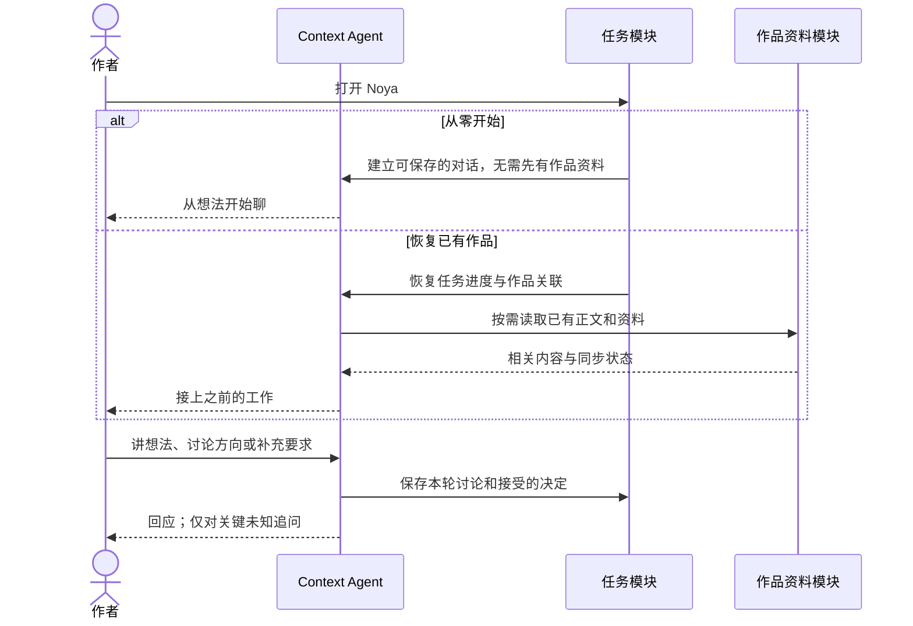
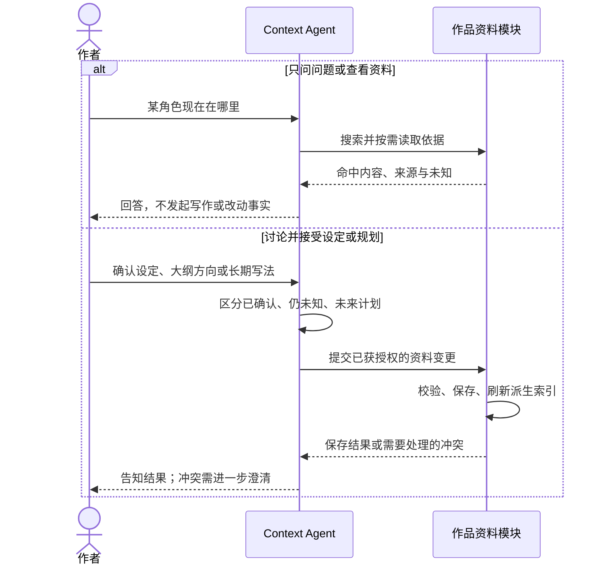
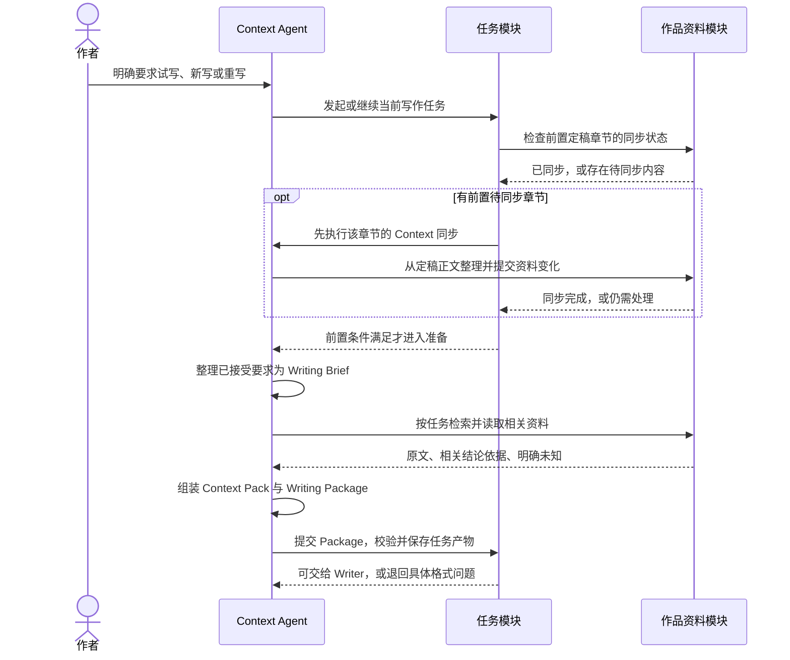
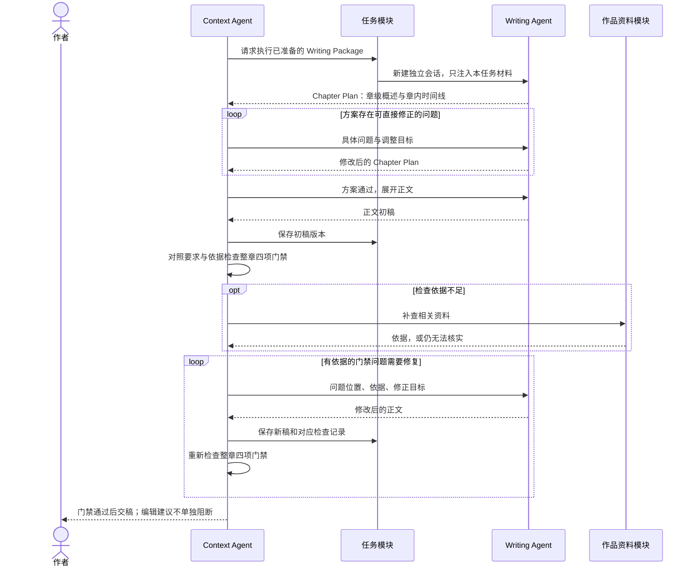
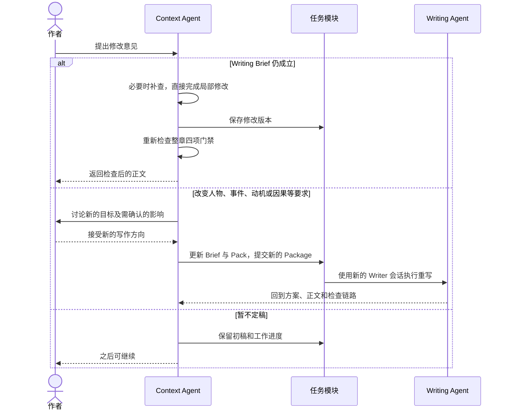
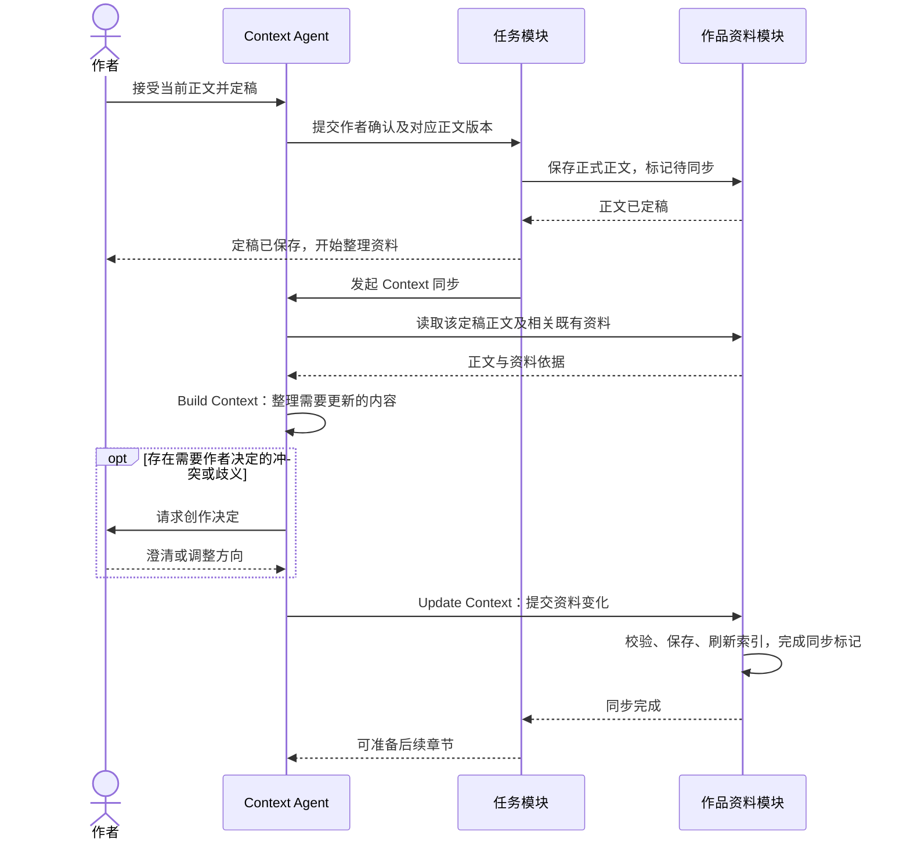
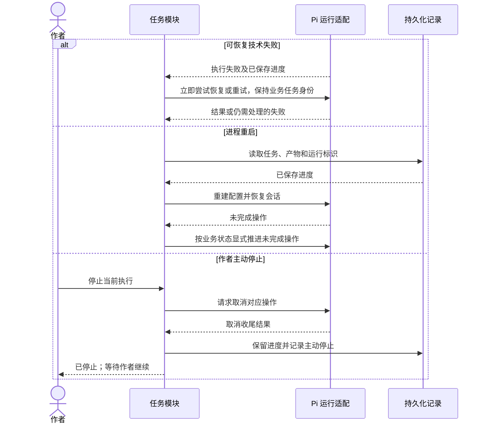
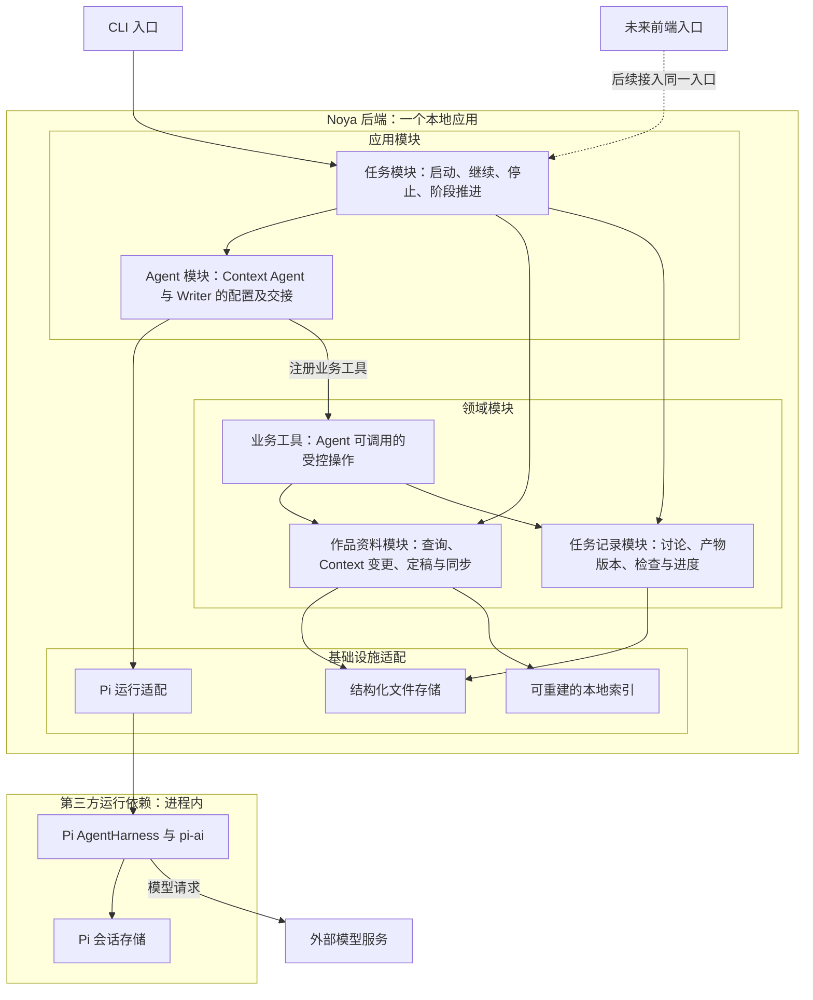

# Noya MVP：交互时序与模块架构

日期：2026-09-27。状态：讨论稿，待逐项确认；不是实现规格，也不表示后端已经实现。

本稿汇总当前对话、CONTEXT.md、四份 ADR，以及 context-types、context-storage、writing-brief、chapter-review。旧产品方案用于补全入口和支路；与后续决定冲突的旧规则不得继续照搬。

图分两类：时序图只表示对象之间的运行时交互；架构图只表示模块归属和依赖。五段 Context 循环不是五个服务，也不是每条消息必须走完的状态机。

## 1. 从零对话、资料操作与发起任务

### 1.1 从零开始或恢复已有工作

以下是业务对象交互视图。作者与 Context Agent 的消息实际经交互入口和任务模块转发；为避免每条消息重复中转，时序图省略入口与 Pi 内部的模型调用。Context Agent 是由 Pi 驱动的逻辑角色，不是自行运行的独立服务。

“开始对话即可保存”是目标；首次会话何时分配作品 ID、何时建立具体写作任务，仍是待确认细节。作者不需要先填表、导入小说或建齐资料。

### 1.2 问答与资料修改不是写作任务的强制前奏

修改已有正式事实时不能跳过影响确认；上图中的提交以相关授权已具备为前提。设定如何由自然语言确认转为可验证的写入授权，尚待接口设计。用户粘贴文字必须辨明正文、参考、设定或笔法范例，参考不能直接变成剧情事实。

### 1.3 Set Context：作者要求动笔后，准备本次输入

同步未完成时，不越过前置条件进入后续章节准备。新书没有历史章节，这项检查直接满足；Pack 可以只含对话里已确认的初始设定。关键创作决定未获授权时回到对话，意图已经明确时不额外增加确认页面。

## 2. Use Context、Build Context 与 Update Context

### 2.1 独立 Writer、方案检查与正文返修

上图描述能够完成检查的路径，并非保证任何情况下循环都收敛。需要改变作者目标时返回对话；补查仍不足、反复修复无进展的处理策略待定，不能自动当作通过，也不能把纯审美意见变成无限重写。

Context 和 Writer 之间的交接由任务模块承载并通过 Pi 执行，不要求两个 Agent 点对点通信。普通返修可继续原 Writer；Writer 必要时可使用资料读取能力，不是禁止补查的能力隔离。

### 2.2 作者反馈：局部修改与结构性重写

局部修改按是否改变 Brief 判断，不按字数。作者自己编辑或贴入的正文同样作为待检查的正文版本处理，不能绕过“草稿不自动成为正式事实”的规则。

### 2.3 定稿与 Context 同步：两个不同的业务动作

同步覆盖按正文实际发生变化的资料，不强制每章改遍所有类型。笔法只有作者接受长期写法或范例后才更新。资料同步失败，正式正文不会退回初稿。

### 2.4 故障恢复与主动停止

恢复不等于生成新的业务任务；实现仍需区分同一 Pi operation 的继续驱动与失败后的新执行尝试。幂等提交、失败分级、重试策略均属于待定工程协议，不从时序图推导“恰好执行一次”。用户主动停止不进入故障重试。

## 3. 模块架构：归属、依赖与外部系统

这是建议的模块分解，不是已实现代码结构。实线箭头表示“调用/使用该模块”，不表示流程先后。框表示代码归属，不表示独立进程或服务；第一版不引入网络检索服务、消息队列或第三个 Agent。

模块职责：

| 模块 | 对外承担的职责 | 内部隐藏的复杂性 |
|---|---|---|
| 任务模块 | 接收用户输入、启动/继续/停止工作、提供进度与结果 | 当前任务与 Pi 执行的关联、阶段前提、等待用户、恢复协调 |
| Agent 模块 | 运行两个角色，交接本次材料与结果 | 提示词、角色会话隔离、工具注册、模型事件转为业务可读结果 |
| 作品资料模块 | 按需查询作品内容、保存已授权的设定变化、定稿与同步 | schema/引用校验、前置版本、幂等写入、索引更新 |
| 任务记录模块 | 保存讨论、Package/Plan/初稿/Review 及其关联 | 版本对应、草稿与正式内容隔离、进度保存 |
| Pi 运行适配 | 提供执行、取消、恢复与事件能力 | Pi 的 session/lane/operation、Provider 和工具接口差异 |

业务工具是 Agent 进入领域模块的受控入口，不是新的 Agent，也不承担自然语言理解。图中的“注册业务工具”表示依赖关系；模型选择工具后由 Pi 执行注册的回调，其运行顺序以时序图解释。

同一文件存储模块可保存不同类别文件，不表示正文、草稿和会话记录混在一个文件。索引由作品资料模块从内容派生和维护，不由文件自己“调用索引”。Pi 会话存储是运行依赖，不作为七类作品 Context 的真源。

### 三类数据不可混成一个真源

| 数据类别 | 内容 | 用途与权限 |
|---|---|---|
| 正式作品 Context | 正文章节、大纲、世界志、人物志、资料库、伏线、笔法 | 可供后续任务取材；分别区分已发生事实、作者已定计划和写法指导 |
| 任务记录与产物 | 讨论记录、作者接受的要求、Brief、Pack、Plan、初稿、Review、同步待办与状态 | 保存工作进度；不能因为落盘就升级为正式剧情 |
| 运行与派生数据 | Pi 会话/operation、工具结果；ID/关键词等索引 | 会话支撑执行恢复，索引支撑查找；二者都不替代正式作品文件 |

七类 Context 的职责沿用 [context-types.md](context-types.md)。世界志层级、稳定 ID 与分文件方式沿用 [context-storage.md](context-storage.md)。不新增“所有事实都必须拆成原子记录”的模型。

格式已确定为 schema 约束的结构化文件，字段中允许 Markdown。JSON 或 YAML 的最终序列化选择尚待拍板；“先 JSON”仍是建议。Pi 工具参数有自动类型转换，业务侧需在原始参数和产物边界严格校验。

## 4. 所有支路共同遵守的运行规则

| 情况 | 行为 | 不得出现 |
|---|---|---|
| 新用户没有作品 | 先聊；允许发起第一个写作任务 | 要先导入小说、建齐七类资料才能开始 |
| 单纯问答 | Context Agent 直接查阅并回答 | 每条消息强制生成 Package 或调用 Writer |
| 作者明确停止 | 停止当前执行，保留已保存进度；继续由作者发起 | 把主动停止当网络故障立即自动重跑 |
| 可恢复技术失败 | 立即尝试重试；保持任务身份，避免重复写入 | 把技术重试等同于新建一个写作任务 |
| 进程中断后恢复 | 恢复任务和运行记录，重建配置后推进未完成操作 | 默默创建第二份章节或重复同步已应用变化 |
| 等待作者决定 | 保留任务与具体问题，等待输入 | 擅自补成作者已确认的事实 |
| 作者已定稿，资料同步失败 | 正文保持正式；资料处于待同步 | 退回未定稿初稿 |
| 待同步时准备后续章节 | 先补齐前置同步，再整理本次 Package | 不作提示地按过期人物状态续写 |
| 修改既有正式事实 | 先确定影响、适用位置和用户意图 | 把后续角色状态倒灌进历史章节 |
| 导出 | 旧产品方案要求按顺序导出正式正文 | 把初稿、废案或资料拼进成稿 |

主动停止与故障中断必须区分。技术重试的次数/退避/永久失败条件、并发写入策略、完整恢复协议尚未定案；“立即重试”不解释成对缺密钥等永久错误无限循环。

新写作任务不直接继承上个任务的临时对话；恢复同一未完成任务则需要保留该任务进度。这里不要求用户理解 Pi 的会话、lane 或 operation。

## 5. 对齐旧方案，避免两套设计同时指导开发

| 旧描述 | 当前口径 |
|---|---|
| PRD 4.4：正文、资料、历史在定稿时一起生效；失败回初稿 | 已被 ADR 0002 替代：正文定稿与资料同步分离 |
| 开始前默认已有作品可检索 | 本轮明确纠正：从零对话与首次写作必须成立 |
| 早期 Markdown-first 存储 | 已被 ADR 0003 替代：结构化文件，文本字段可含 Markdown |
| 独立检索服务或第三个检索 Agent | 不采用；Context Agent 用本地确定性工具 |
| 每轮都 Set Context，或冻结整套 Context | 不采用；按任务准备，可补查和更新 |
| 将“本章安排”视为唯一写作交接物 | 当前拆为作者要求 Brief、相关材料 Pack、Writer 方案 Plan；与旧数据的迁移映射尚待定义 |
| 固定两轮返修，或文笔评分决定交付 | 不采用；四项门禁和编辑建议分开，暂无固定返修轮数上限 |

旧 PRD 中的多书切换、导出、历史回退、开书试写保留为产品需求来源，但其全部实现范围并不因进入这张图而自动纳入第一刀。特别是旧章回改、整体撤销与按章历史状态读取，需要单独明确可交付范围。

## 6. 架构尚未闭合的决定，不在图里伪装成已定

1. 从零聊天的会话怎样归入新作品、任务何时正式建立；首次输入必须能保存，不能要求先填作品信息。
2. 作者直接确认设定时的持久化时点和修改既有事实的授权边界。
3. Brief、Pack、Plan、Review 与正文版本的具体契约；正文变化后旧 Review 失效，但不因此引入整套 Context 冻结。
4. 补查仍不足、反复修复不收敛时怎样把控制权交回作者；不能擅自加固定轮数或标记通过。
5. 业务写入的一致性、幂等、前置版本检查及同步中断恢复实现。
6. 单作品并发策略，以及旧文回改/历史状态/撤销/导出在首个完整 MVP 的覆盖范围。

确认后才将本稿收敛为工程接口与实施计划。本次不修改已有 ADR 的确认状态，不生成小说，不实现后端，不提交 Git。
