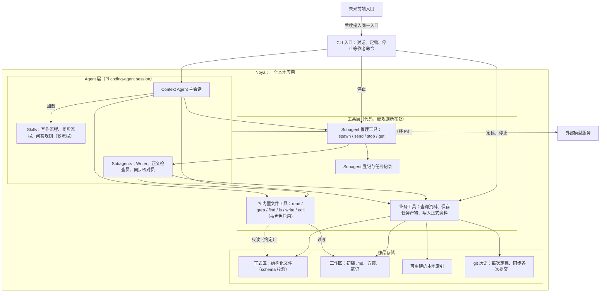
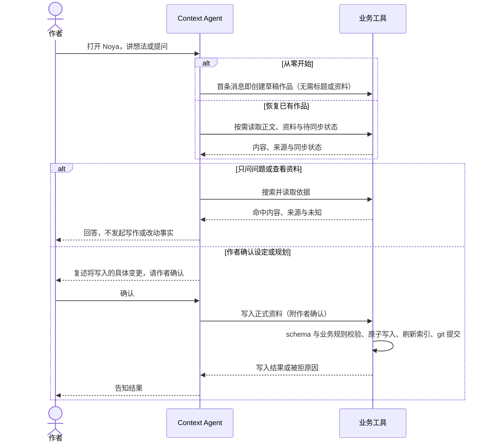
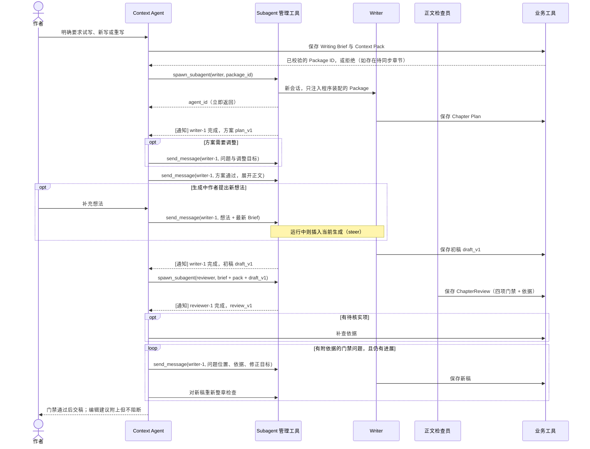
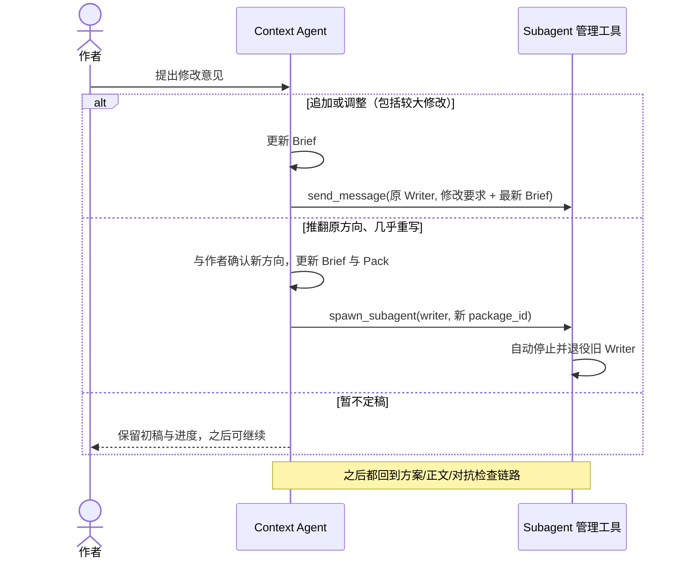
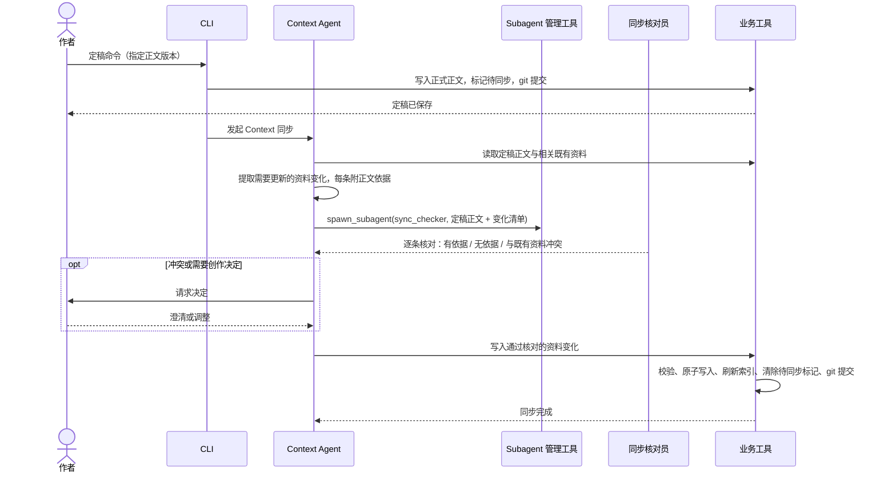
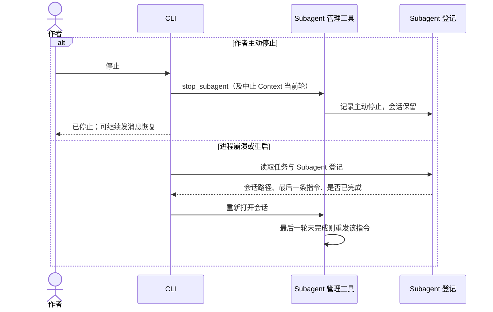

# Noya MVP：交互时序与模块架构

日期：2026-09-27。状态：讨论稿；架构方向已在本轮讨论中收敛，工具签名与细节仍待实现时校准，不表示后端已经实现。

本稿汇总 CONTEXT.md、四份 ADR，以及 context-types、context-storage、writing-brief、chapter-review，并吸收本轮架构评审的结论：**基于 Pi 二次开发，Agent Runtime 直接复用；Noya 只做三件事——用 Skills + Subagent 控制流程、用写入工具的硬门禁守住入库、用 Subagent 对抗做质量保障。** 不自建编排状态机，不自建运行时恢复协议。

图分两类：时序图只表示对象之间的运行时交互；架构图只表示模块归属和依赖。五段 Context 循环不是五个服务，也不是每条消息必须走完的状态机。

## 0. 架构原则

1. **流程写在 Skill 里，规则写在代码里。** Skill 描述 Context Agent 应该怎样推进写作、同步、问答；它是给模型的指令，模型可能跳过或记错。凡是"绝不能发生"的事，必须由业务工具或 Subagent 工具在代码中拒绝，不依赖提示词。
2. **隔离靠 Subagent 的独立会话。** Writer、正文检查员、同步核对员各自拥有独立会话，只接收程序按 ID 装配的输入，看不到作者讨论、废案和原始检索过程。
3. **正式资料只经由带门禁的写入工具进入。** 门禁包括 schema 校验和少量业务规则（见 §4.2），写入原子化并提交 git。内置文件工具只用于工作区；MVP 不在代码中限制其目录，依靠 git 发现和回滚越界修改（见 §4.3）。
4. **质量靠对抗，不靠自评。** 生成方与检查方是不同的 Subagent；检查结论必须附依据，无依据的意见不阻断交付。
5. **崩溃只重做未完成的那一轮。** 所有会话落盘；已完成步骤的产物都已通过工具保存，重启后重新打开会话、重发最后一条未完成的指令即可。

## 1. 模块架构

这是建议的模块分解，不是已实现代码结构。实线箭头表示"调用/使用"，不表示流程先后。第一版不引入网络检索服务、消息队列或独立的编排服务。

| 模块 | 职责 | 备注 |
|---|---|---|
| Context Agent 主会话 | 与作者对话、检索资料、整理 Brief/Pack、决定何时派发 Subagent、转达作者的新想法、执行同步提取 | Pi coding-agent session，会话 JSONL 落盘 |
| Skills | 描述写作、同步、问答的推荐步骤 | 软约束；不承担任何必须成立的规则 |
| Subagents | Writer 生成方案与正文；检查员按四项门禁检查；同步核对员核对资料变化是否有正文依据 | 每个 Subagent 有独立、落盘的会话 |
| Subagent 管理工具 | 创建、发消息、停止、查看 Subagent；推送完成通知 | 见 §3 |
| 业务工具 | 查询作品、保存任务产物、写入正式资料 | 硬门禁所在处，见 §4 |
| 作品存储 | 正式资料文件、派生索引、git 历史 | 索引可重建；git 提供版本、diff、回滚与来源追溯 |

### 1.1 Pi 接入方式

- 使用 **coding-agent SDK（`createAgentSession`）**，而非研究文档原先推荐的 `AgentHarness`：Skills 与扩展机制只在 coding-agent 层提供。代价是 coding-agent 基于裸 `Agent`，没有 operation 级恢复，本架构用"会话落盘 + 重做未完成一轮"代替（原则 5）。
- 必须关闭编码场景默认行为：不自动发现全局/祖先目录的 AGENTS 文件、skills、extensions，只加载 Noya 自己的 Skills 与工具；内置工具按角色显式启用（§4.3），不使用默认的 read/bash/edit/write 组合；验收时检查实际发给模型的提示词。见 [pi-local-source-audit](../research/pi-local-source-audit-2026-09-25.md)。
- **Pi 没有内置 Subagent**，只有示例扩展（`examples/extensions/subagent`），其做法是 `--no-session` 的一次性子进程，不能继续对话也不能恢复。Noya 自己实现 §3 的四个工具，不直接照搬示例。
- Subagent 可以实现为 `pi` 子进程（带 `--session <path>`、RPC 模式支持 `steer`/`follow_up`），也可以在进程内用 `createAgentSession` + `SessionManager.create/open` 创建。两者对 §3 的工具接口无影响；差别在于子进程需要把业务工具打包成 Pi 扩展装入，进程内可直接注册。
- 这一选型改变了研究文档原先的推荐，记录于 [ADR 0005](../adr/0005-build-on-pi-coding-agent-with-skills-and-subagents.md)。

## 2. 交互时序

### 2.1 从零开始、问答与资料修改

"首条消息即创建草稿作品"是本稿的默认方案：作品 ID 在第一条消息时生成，一次对话即一个任务，写作是任务中的阶段。作者不需要先填表、导入小说或建齐资料。用户粘贴的文字必须辨明是正文、参考、设定还是笔法范例，参考不能直接成为剧情事实。

### 2.2 写作：准备、派发 Writer、对抗检查

- **检查员每次都是新会话**，只拿 Brief、Pack 和当前稿，看不到讨论与废案，也不受上一轮检查结论牵制。输出使用 [ChapterReview schema](chapter-review.md)：明确冲突必须附依据原文，否则只能是待核实或编辑建议。
- **停止条件**：同一条冲突（按类别与依据 ID 识别）连续两轮未修复，或冲突数量不再下降时，把当前稿与检查结果交给作者决定。这不是固定轮数上限；补查仍不足的待核实项同样交作者，不能当作通过。
- 纯措辞修正仍可由 Context Agent 直接完成（CONTEXT.md 中的局部修改），修改后同样重新检查整章。

### 2.3 作者反馈：继续原 Writer 还是新开

判断依据是"追加调整"还是"推翻方向"，不按字数。理由：给模型追加信息可靠，让它撤回已在上下文里的旧方案不可靠。无论哪种，每次都随消息附上最新 Brief，让 Writer 以当前要求为准，而不是依赖对历史的记忆。作者自己编辑或贴入的正文同样作为待检查版本处理。

### 2.4 定稿与 Context 同步

- 定稿只能由作者通过 CLI 命令触发，模型不能自行宣布定稿（§4.2）。
- 同步核对员是对抗式检查在资料入库上的应用：它只回答"这条变化在正文里有没有原文依据、是否与既有资料冲突"，防止格式合法但内容错误的事实入库。
- 同步覆盖正文实际引起变化的资料，不强制每章改遍所有类型。笔法只有作者接受长期写法或范例后才更新。同步失败时正式正文不退回初稿。

### 2.5 停止与崩溃恢复

已完成步骤的产物都已由工具落盘并提交 git，崩溃只损失正在生成的那一轮。主动停止不触发重试；可恢复的技术失败（网络、限流）由 Pi 自带的技术重试处理，缺密钥等永久错误不重试。

## 3. Subagent 管理工具

### 3.1 工具定义

| 工具 | 参数 | 行为 |
|---|---|---|
| `spawn_subagent` | `role`（writer / reviewer / sync_checker）、`input_ref` | 按 ID 装配输入，创建独立会话并开始执行，立即返回 `agent_id` |
| `send_message` | `agent_id`、`message` | Subagent 运行中则插入当前生成（steer）；空闲则开始新一轮 |
| `stop_subagent` | `agent_id` | 中止当前一轮，保留会话，之后可继续发消息 |
| `get_subagents` | `agent_id?` | 不传 ID 返回本任务所有 Subagent 的简要状态；传 ID 返回详情：角色、状态（运行中/空闲/已停止/失败）、输入 Package、最近一次产物、失败原因 |

### 3.2 异步与状态感知

- `spawn_subagent` 和 `send_message` 都**不等待**结果，否则 Context Agent 会在 Writer 生成的几分钟内卡在工具调用里，无法转达作者的新想法。
- Subagent 完成、失败或停止时，程序**主动**向 Context Agent 推送通知（Pi `followUp`），如 `[writer-1 完成] 初稿已保存为 draft_v2`。
- 每轮自动在 Context Agent 输入中附一行当前 Subagent 状态摘要，模型不调用工具也能看到。`get_subagents` 是长对话压缩后或进程重启后的兜底，不是日常轮询手段。

### 3.3 工具内的硬规则

1. **`spawn_subagent` 只接受 `input_ref`，不接受任意文本 prompt。** 程序按 ID 读取已通过校验的 Package（或 Brief + Pack + 稿件版本），由代码保证 Writer 与检查员看不到讨论和废案。
2. **通知只带产物 ID，不带全文。** 正文保存为版本，Context Agent 需要时再读，避免每轮返修把整章正文堆进主会话。
3. **每个任务同时只有一个活跃 Writer。** 为重写新开 Writer 时，程序自动停止并退役旧 Writer。
4. **Subagent 登记落盘。** agent ID、角色、会话文件路径、输入引用、状态、最后一条指令写入任务记录，重启后据此恢复。

## 4. 数据与入库门禁

### 4.1 三类数据不可混成一个真源

| 数据类别 | 内容 | 用途与权限 |
|---|---|---|
| 正式作品 Context | 正文章节、大纲、世界志、人物志、资料库、伏线、笔法 | 可供后续任务取材；分别区分已发生事实、作者已定计划和写法指导；受 git 版本管理 |
| 任务记录与产物 | 作者接受的决定、Brief、Pack、Plan、初稿版本、Review、Subagent 登记、同步待办 | 保存工作进度；不能因为落盘就升级为正式剧情 |
| 运行与派生数据 | Pi 会话 JSONL、索引 | 会话支撑对话继续与崩溃恢复，索引支撑查找；二者都不替代正式作品文件 |

完整对话只保存在 Pi 会话中；Noya 的任务记录只保存作者接受的决定与各类产物，不另存一份对话副本。七类 Context 的职责沿用 [context-types.md](context-types.md)，世界志层级、稳定 ID 与分文件方式沿用 [context-storage.md](context-storage.md)。格式为 schema 约束的结构化文件，字段中允许 Markdown；JSON 或 YAML 的最终序列化选择尚待拍板，"先 JSON"仍是建议。

### 4.2 写入工具的硬门禁

**格式门禁**

- 工具原始参数在 `prepareArguments` 中用不做类型转换的 validator 严格校验（Pi 默认会把数字 ID 转成字符串）。
- Brief、Pack、Plan、Review 与所有正式资料在落盘前按各自 schema 校验，引用的 ID 必须存在于当前作品。

**业务门禁**

| 规则 | 拒绝的情况 |
|---|---|
| 定稿只能来自作者命令 | 模型自行调用写入正式正文 |
| 同步只以定稿正文为来源 | 用初稿、废案或参考文字更新人物志等资料 |
| 存在待同步章节时不能准备后续章节 | 在过期的人物状态上保存新的 Package |
| 讨论中写入设定需附作者确认 | 模型未经确认把自己的建议写成正式设定 |

**一致性**：每次写入要么完整生效并提交 git，要么什么都不改（临时文件 + rename，最后提交）。这是"崩溃只重做未完成一轮"安全成立的前提。

**版本与来源**：作品目录是 git 仓库，由程序在后台操作，作者不需要感知。每次定稿、每次同步各一次提交，提交信息带章节 ID，由此获得历史、diff、回滚与"这条设定来自哪一章"的追溯。

**只提交自己写的文件**：业务工具提交时只 `git add` 本次写入的文件，不整目录提交。若正式区存在其他未提交修改（例如模型用内置工具直接改了人物志），报告给作者决定保留或回滚，不随本次提交一起成为正式事实。

### 4.3 正式区、工作区与 Pi 内置工具

作品目录分两区：

- **正式区**：正文章节与七类资料。约定只由业务工具写入。
- **工作区**：每个任务一个目录，存放初稿、章节方案与临时笔记。内置工具可自由读写。

**初稿存为 `.md` 纯文本**，不存为 JSON 字符串字段：`edit` 按原文精确匹配替换，JSON 中转义的换行和引号会让匹配频繁失败。初稿是任务产物，不属于 ADR 0003 约束的正式资料；定稿时由业务工具转为结构化章节文件并校验。

Pi coding-agent 预置 8 个工具，MVP 按角色启用：

| 角色 | 启用的内置工具 | 用途 |
|---|---|---|
| Context Agent | `read`、`grep`、`find`、`ls`、`edit` | 读正文、搜索情节出现位置；`edit` 用于工作区内的措辞修正 |
| Writer | `read`、`grep`、`write`、`edit` | `write` 写首版方案与正文；`edit` 返修时只改问题段落，对应检查反馈的"原文摘录 + 修正目标" |
| 检查员、同步核对员 | `read`、`grep` | 只读核对依据 |

- 结构化资料（人物志、世界志等）仍优先用业务工具按节点读取，避免把整个 JSON 文件读入上下文；`grep` 作为正文检索的补充。
- **`bash`、`powershell` 不开放。** bash 可绕过所有门禁，且作者粘贴的参考文字可能夹带提示词注入。需要执行的脚本包装为具名业务工具，如 `count_words`、`validate_work`、`rebuild_index`、`export`。
- **MVP 不做目录限制。** Pi 没有内置的目录限制（其文档明确工具以进程权限运行、不做沙箱），工具接受绝对路径和 `~`。MVP 不自行实现，依靠 git 发现与回滚正式区内的越界修改。已知风险：作品目录之外的写入与读取不在 git 保护范围内，读到的内容也已发送给模型服务。后续如需限制，可包装内置工具在执行前解析真实路径并按角色校验（grep/find 通过 `rg`/`fd` 子进程搜索，替换 `operations` 拦不住，需在包装层校验参数）。
- **打包 `rg` 与 `fd`**：grep/find 依赖二者，本机缺失时 Pi 会在运行时自动下载；Noya 应随包提供，避免作者首次搜索时联网下载可执行文件。

## 5. 所有支路共同遵守的运行规则

| 情况 | 行为 | 不得出现 |
|---|---|---|
| 新用户没有作品 | 先聊；首条消息即创建草稿作品，允许发起第一个写作任务 | 要先导入小说、建齐七类资料才能开始 |
| 单纯问答 | Context Agent 直接查阅并回答 | 每条消息强制生成 Package 或派发 Writer |
| 作者明确停止 | 停止当前执行，保留会话与进度；继续由作者发起 | 把主动停止当网络故障自动重跑 |
| 技术失败 | 由 Pi 技术重试处理；永久错误直接报告 | 把技术重试等同于新建写作任务，或对缺密钥无限重试 |
| 进程中断后恢复 | 重新打开会话，重发未完成的最后一轮 | 重复生成第二份章节或重复写入已提交的变化 |
| 等待作者决定 | 保留任务与具体问题，等待输入 | 擅自补成作者已确认的事实 |
| 作者已定稿，资料同步失败 | 正文保持正式；资料处于待同步 | 退回未定稿初稿 |
| 待同步时准备后续章节 | 工具拒绝，先补齐前置同步 | 按过期人物状态续写 |
| 修改既有正式事实 | 先确定影响、适用位置和作者意图，经作者确认再写入 | 把后续角色状态倒灌进历史章节 |
| 并发 | 同一作品同时只有一个进行中的任务（文件锁），每个任务只有一个活跃 Writer | 两个 Writer 同时改同一章 |

新写作任务不继承上个任务的临时对话；恢复同一未完成任务则保留该任务的会话。作者不需要理解 Pi 的会话或 Subagent 概念。

## 6. 对齐旧方案，避免两套设计同时指导开发

| 旧描述 | 当前口径 |
|---|---|
| PRD 4.4：正文、资料、历史在定稿时一起生效；失败回初稿 | 已被 ADR 0002 替代：正文定稿与资料同步分离 |
| 开始前默认已有作品可检索 | 已纠正：从零对话与首次写作必须成立 |
| 早期 Markdown-first 存储 | 已被 ADR 0003 替代：结构化文件，文本字段可含 Markdown |
| 独立检索服务或第三个检索 Agent | 不采用；Context Agent 用本地确定性工具 |
| 每轮都 Set Context，或冻结整套 Context | 不采用；按任务准备，可补查和更新 |
| 将"本章安排"视为唯一写作交接物 | 拆为 Brief、Pack、Plan；与旧数据的迁移映射尚待定义 |
| 固定两轮返修，或文笔评分决定交付 | 不采用；四项门禁与编辑建议分开，以"无进展即交作者"代替轮数上限 |
| 由 Context Agent 在主会话内检查正文门禁 | 改为独立的检查员 Subagent，每次新会话 |
| Pi 接入使用 `AgentHarness`，由 Noya 任务模块编排 | 改为 coding-agent SDK + Skills + Subagent（ADR 0005） |
| 任务模块协调 operation 级恢复、幂等与重试 | 不自建；会话落盘 + 重做未完成一轮 + 写入原子化 |
| 不启用任何 Pi 内置工具 | 按角色启用 read/grep/find/ls/write/edit；不开放 bash；MVP 不做目录限制，git 兜底 |

旧 PRD 中的多书切换、导出、历史回退、开书试写保留为产品需求来源，但不因进入本稿而自动纳入第一刀。旧章回改在 MVP 中的口径：允许重新定稿旧章，但只把其后章节的同步标记为可能过期并提示作者，不做自动重算。

### 已同步修改的既有文档

- **CONTEXT.md**：「局部修改 / 结构性重写」改为按"追加调整 / 推翻方向"划分；新增正文检查员、同步核对员。
- **ADR 0001**：正文检查改由独立检查员 Subagent 执行；修改边界同上。
- **ADR 0005**：记录改用 coding-agent SDK + Skills + Subagent 的选型及其代价。
- writing-brief、chapter-review 中与上述边界相关的描述已同步。

## 7. 尚未闭合的决定

1. Subagent 以 `pi` 子进程还是进程内会话实现（不影响 §3 接口）。
2. Brief、Pack、Plan、Review 与正文版本的具体契约；正文变化后旧 Review 失效，但不引入整套 Context 冻结。
3. 讨论中写入设定时"作者确认"的具体形式（CLI 确认提示或特定回复格式）。
4. 同步核对员的输出 schema。
5. "无进展"判定中识别同一条冲突的具体规则。
6. 导出、历史状态读取与撤销在首个完整 MVP 的覆盖范围。
7. 内置工具的目录限制何时引入（MVP 不做，见 §4.3）。

本稿不实现后端。
