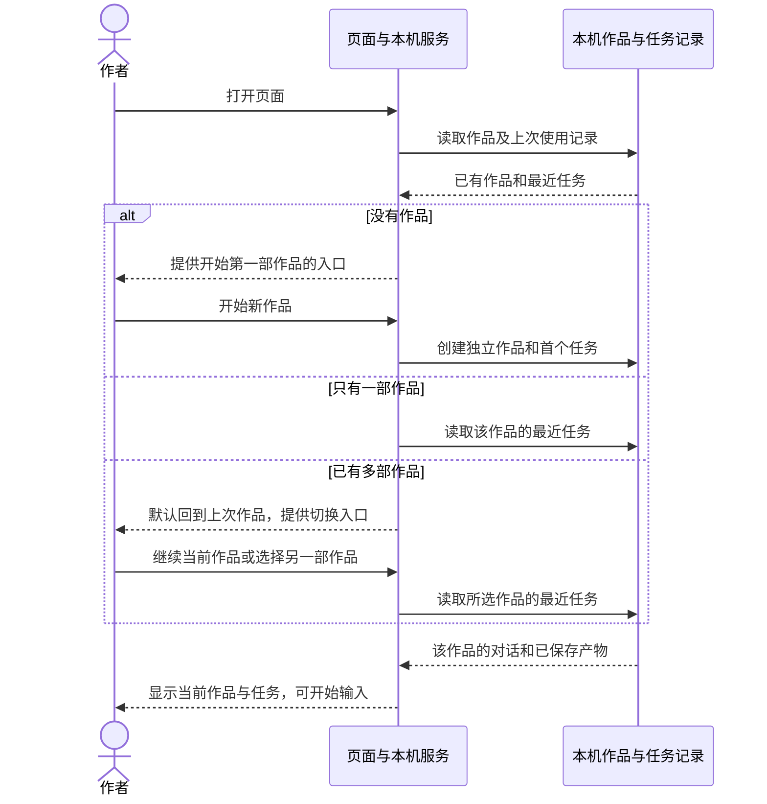
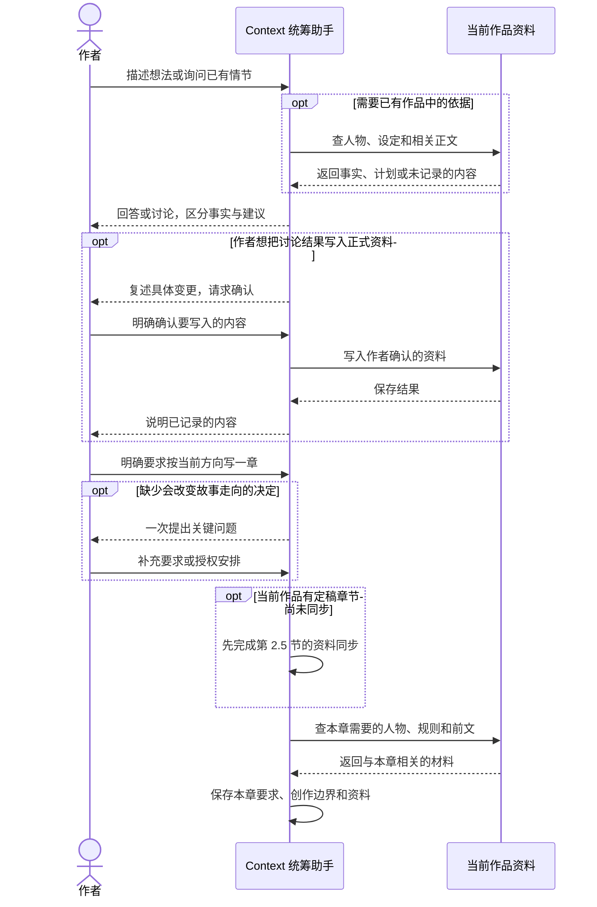
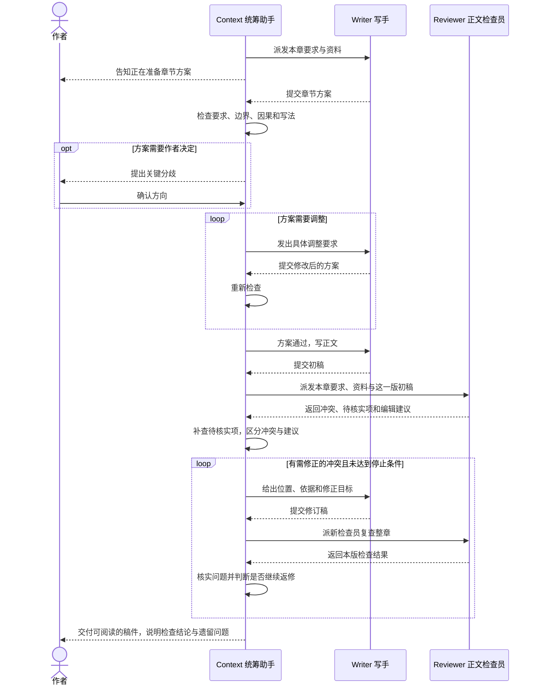
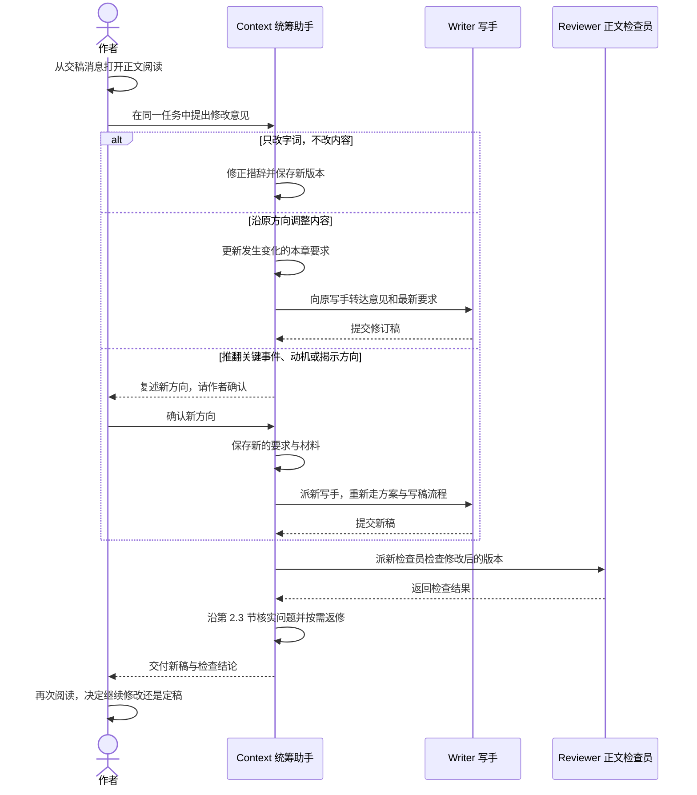
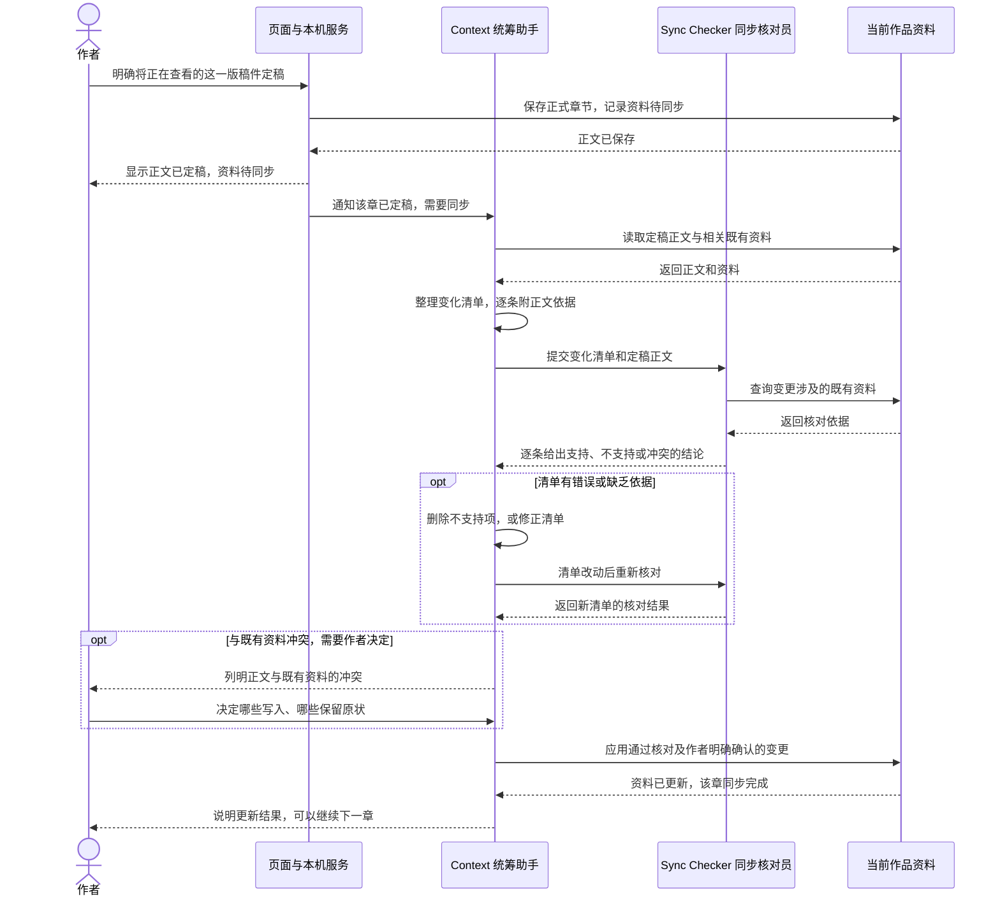
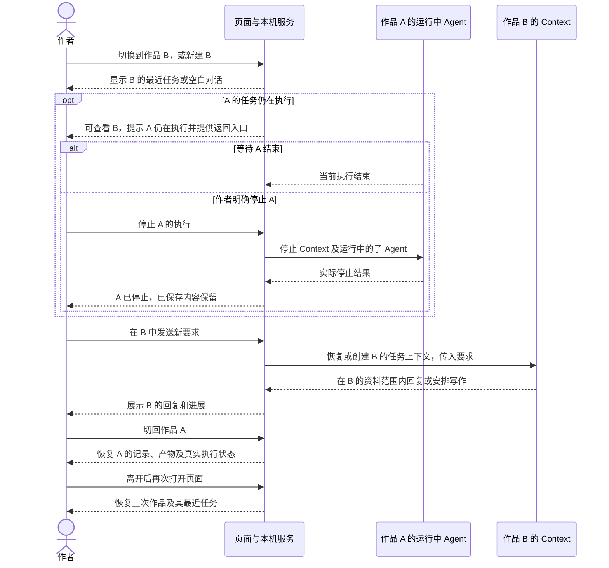

# Noya 本地任务界面 · MVP 用户旅程

当前目标：让作者通过一个页面完成一次真实写作任务。用户已于 2026-10-04 确认下面六段旅程及优化后的可点击页面可作为 MVP；两者共同构成后续实现的设计基线。真实页面接入与执行验收尚未开始。

## 1. 作者要完成什么

作者启动 Noya，选择或新建作品，告诉 Agent 想做什么。Agent 与作者讨论，准备材料并执行；需要读稿时，作者在页面里打开正文，提出修改或确认定稿。作者可以在多部作品之间切换，每部作品分别保留自己的任务、资料和产物。

首次使用也可以什么都没有，从一个想法开始聊。已有作品则继续现有内容。进入讨论不要求先填作品名称、题材、设定或章节安排。

## 2. 按职责拆开的用户旅程

以下沿用当前 v0 的四个 Agent 角色。作品入口、浏览器读稿、运行中切换与统一停止已纳入可点击设计稿，真实业务接入尚待实现；Agent 的写作与同步分工已经按当前流程核对。

| 角色 | 职责 |
|---|---|
| Context · 统筹助手 | 唯一与作者对话的 Agent；讨论、查资料、确认资料变更、准备本章材料、派写手、审方案、处理检查结果、交稿与应用资料同步 |
| Writer · 写手 | 依据本章要求与材料提交章节方案，方案通过后写正文，并按意见返修 |
| Reviewer · 正文检查员 | 对照本章要求、资料和指定版本初稿做检查；返回冲突、待核实项与编辑建议，不直接改稿 |
| Sync Checker · 同步核对员 | 对照定稿正文和既有资料核对变更清单，不提取变化、不写入资料 |

作者与 Context 的箭头都经由同一个任务页面；为看清分工，下面省略重复的页面转发。作品资料与 Noya 页面及本机服务是系统能力，不是额外 Agent。角色跟随所属作品和任务，不意味着每部作品常驻四个运行中的 Agent。

### 2.1 打开页面，进入或新建作品

没有有效的上次作品时，展示已有作品供作者选择；作品还没有任务时，进入该作品的空白起点。新作品可以从一个想法开始，不要求先填标题、类型或设定表。

### 2.2 讨论、查资料与准备写作

讨论本身不会启动写手。写手收到整理后的本章要求与材料，不读取作者和 Context 的整段聊天记录。

### 2.3 方案、正文、检查与交稿

方案通过由 Context 决定。只有确实需要作者作创作决定时才询问作者。自动返修不会无限循环：四项检查全部通过、同一冲突连续两轮未修好，或冲突数量没有下降，就停止返修并如实交稿；交稿不等于检查全部通过或已经定稿。

### 2.4 作者读稿，再提修改

原写手已经不可恢复时，Context 依据保存的材料重新派出写手，并告知作者；不将历史记录恢复解释为原写手还在运行。作者在写作中途提出新意见，也按这里的“沿原方向调整／改变关键方向”处理。

### 2.5 作者定稿，随后同步资料

作者决定改变冲突项的具体内容时，Context 先重提清单并重新核对，再应用。核对通过的正常变化由 Context 自动应用。同步失败或仍待作者决定时，正文保持已定稿，页面继续显示资料未同步完成；当前作品下一次写作前先处理待同步内容。

### 2.6 切换作品，以及离开后再回来

这里将 A 当时正在执行的 Context、Writer、Reviewer 或 Sync Checker 合并为一条泳道，只为说明切换行为；各角色职责见前面的细图。首版一次只执行一个作者任务，切换本身只改变查看内容，不启动新任务，也不取消旧任务。每部作品的对话、资料和产物分别保存。

关闭页面与退出本机程序要区分：仅关闭页面后，回来应显示本机服务的真实运行状态；程序已经退出时，原子 Agent 执行已中断，恢复的是任务记录与保存结果。需要继续时由 Context 根据记录重新安排，不能显示为一直在运行。

### 不顺利时怎样继续

| 情况 | 作者看到什么 | 如何继续 |
|---|---|---|
| 想中止当前执行 | 明确停止哪部作品，以及实际停止后的结果 | 已保存内容保留，作者决定接下来怎么做 |
| 写手或正文检查失败 | Context 说明失败发生在哪一步、已有内容是什么 | 作者决定重新执行或调整要求，不把失败当作交稿完成 |
| 同步核对员失败 | 首次失败由 Context 按现有规则重派一次；仍失败则告知作者 | 保留定稿正文和待同步状态，处理后继续同步 |
| 正文已定稿，资料整理未完成 | 正文已保存、资料待处理的两个状态 | Context 继续处理；下一次写作前先完成同步 |
| 本机程序退出后重新打开 | 原任务记录和已保存产物，中断的执行如实标明 | Context 按保存内容安排继续，不承诺原子 Agent 自动续跑 |

## 3. 页面由旅程推导

首版只需要两个核心空间：

- **任务空间**：作者输入、Agent 回复、实际执行进展，以及需要作者回答的问题。发送、停止和继续任务在这里完成。
- **阅读空间**：从交稿消息打开完整正文；作者读完回到同一任务提意见，或对这份明确的初稿定稿。

作品入口只承接当前作品标识、选择已有作品、新建作品和恢复该作品最近任务。它可以是轻量的切换入口，暂不据此增加独立作品管理页。是否需要常驻侧栏、内容目录或更多操作，须有这条主线中的明确需要才能增加。

登录和本机连接只在确实阻挡使用时处理。已经配置好的作者应直接开始当前工作。

## 4. 第一版怎样算可用

作者可以新建或进入作品，完成“提出写作要求 → 收到可读初稿 → 提一次修改 → 收到新稿 → 定稿”，切到另一部作品继续工作，再切回来找到原来的记录。关闭后能找回上次作品及其最近任务；切换时任务仍在执行，也能明确知道在哪里运行、怎样停止或继续。过程中不需要到命令行或文件目录里找正文，也不需要手动指挥写手、检查员和资料同步。

这条主线已对齐；当前设计稿只围绕作品切换、任务对话和正文阅读展开，页面操作由这条主线推导。能力走查见 `capability-walkthrough.md`，浏览器验证结果见 `design-validation.md`。
