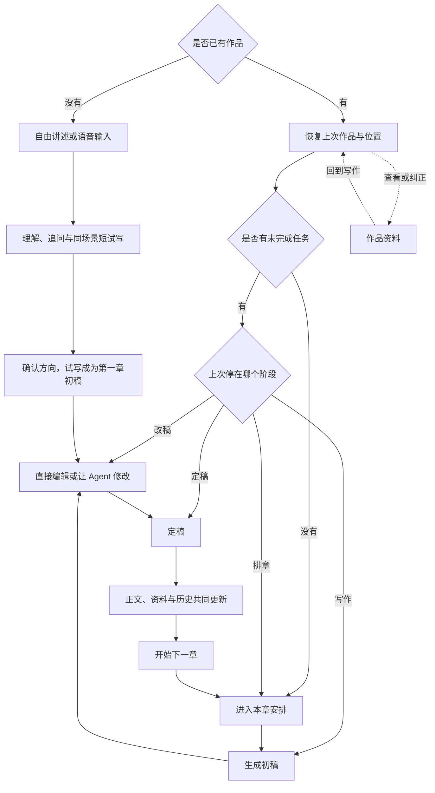

# Noya 小说 Agent · MVP

## 1. 背景与目标

长篇小说写到后面，真正困难的不是多写几千字，而是让人物、规则、伏线、作者已经否掉的方向和正文始终对得上。它们一旦混在越来越长的聊天记录里，Agent 就容易重新捡起旧方案、忘记关键物品，或把后期才发生的事实写进前文。

Noya 面向独立写作者。作者负责决定故事的方向，Agent 负责理解、试写、安排章节、生成正文，并把定稿后成立的新事实整理回作品。产品要做到三件事：

1. 作者从一个模糊念头开始，也能较快看见一段“像自己心里那本书”的正文。
2. 日常写作时，作者主要阅读和修改正文，不需要亲自维护一套复杂资料表。
3. 作品写得再长，Agent 仍能依据当时正确的事实继续写，所有正式修改都能追溯和回退。

MVP 覆盖从开书、连续写章到导出成稿的个人创作闭环，不承担发布、平台运营或多人协作。

## 2. 产品逻辑

没有作品时，作者从自由讲述开始；已有作品时，优先恢复上次那本书尚未完成的任务，没有未完成任务才打开当前章节。开书阶段通过少量追问和同场景短试写找准故事；作者确认方向后，这段试写直接成为可继续写、可修改的第一章初稿，而不是再从头生成一次。日常阶段围绕“安排本章—生成初稿—修改—定稿”循环。每次工作都从这本书已经保存的正文与资料中重新准备所需内容，只有作者接受的结果会继续影响后文。

## 3. 功能清单

| 功能 | 说明 |
|---|---|
| 开启一本新书 | 从自由讲述、关键追问和短试写中逐步显出故事，并进入正式第一章 |
| 恢复与切换作品 | 直接回到每本书自己的未完成任务，也能在同一工作台切换其他作品 |
| 安排并写作章节 | 用高层故事事件决定本章，再由 Agent 生成可继续修改的初稿 |
| 修改与定稿 | 支持正文直改、选段修改、撤销和原子定稿，定稿后明确进入下一章 |
| 查看与纠正作品资料 | 用大纲、世界志、人物志、资料库、伏线和笔法承接作品的长期事实与方向 |
| 按任务准备写作材料 | 排章、写章、改稿和改资料分别读取真正相关的内容，避免旧聊天污染新任务 |
| 修改旧事实并回退 | 先展示影响范围，再按作者选择整体生效或整体撤销 |
| 保持长篇一致 | 按章节当时的状态取材，并在关键阶段给少量不阻断写作的质量提醒 |
| 导出成稿 | 将已定稿章节按顺序合并为 TXT，方便作者继续使用或自行发布 |

## 4. 功能描述

### 4.1 从一个念头开始一本书

作者不需要先填写题材、世界观、人物和大纲。一个画面、一个人、一种读者快感、一个奇怪机制、已经想好的结局，甚至一段漫无边际的讲述，都可以成为起点。输入框同时支持文字和语音，方便作者先把脑海里的内容完整说出来。

| 阶段 | 作者经历 | 系统回应 |
|---|---|---|
| 自由讲述 | 作者用自己的方式描述想写的故事 | Agent 先用自己的话复述理解，并明确哪些仍只是推测 |
| 关键追问 | 作者逐轮补充真正会改变故事的内容 | 每轮只追问一个关键问题，通常两至四轮后停止访谈 |
| 确认试写目标 | 作者选择本轮更重视“像心里的故事”还是“让陌生读者追下去” | 需要连载时，再补充平台、男频或女频与核心阅读快感 |
| 同场景短试写 | 作者阅读一个 500—900 字的场景切片，并自然说出哪里好、哪里累、哪里俗 | 下一版继续改同一个场景，每轮只验证两三件事，不靠更换故事制造进展 |
| 确认方向 | 作者认可故事气息与开头方向 | Agent 用一句话说明已确定、仍在试和保持留白的内容，随后进入正式第一章 |

作者说不清问题时，Agent 才辅助询问“哪一刻想继续看”或“从哪里开始觉得不对”，不要求打分或管理一套校准表。作者也可以粘贴自己的旧稿或一小段喜欢的文字；系统只提取节奏、镜头距离、句式和信息密度，再用当前场景验证，不照搬原文中的人物、设定或句子。

试写期间，系统可从目标读者、连载结构、作品原意和前后连贯四个角度检查文本。检查只提供带具体位置的诊断，不直接改正文；Agent 去重判断后，最多向作者呈现两三条真正值得处理的意见。

开书过程从第一次输入起自动保存：

- 关闭页面或返回原作品后，再次开始新书可以继续原草稿，也可以明确重新开始。
- 从已有作品进入时，返回会恢复刚才的章节或资料位置，已经产生的开书内容不会丢失。
- 点击“正式写第一章”后，作者刚刚确认的试写成为第一章初稿的开头，可在同一正文中继续写和修改；已经确认的人物、故事方向与写法分别进入对应资料。它不再被识别为未完成的开书草稿，也不会再从头生成一份重复的第一章。

### 4.2 回到作品并继续上次工作

Noya 的入口优先让作者继续写，而不是先管理书架。系统根据当前状态决定落点：

| 当前状态 | 进入后的落点 |
|---|---|
| 还没有作品 | 直接进入开书流程 |
| 有未完成的排章、写作、改稿或定稿任务 | 回到该任务最近一次保存的位置 |
| 没有未完成任务 | 回到当前正在连载的章节 |
| 上次只浏览了资料 | 保留写作落点；再次主动进入该资料时恢复它自己的浏览位置 |
| 有未完成的开书草稿 | 进入新书流程时先选择继续或重新开始 |

点击当前书名会打开书籍目录。“开始一本新书”固定在第一项，分隔线后才列出已有作品；选择另一部作品后，直接在同一工作台恢复那本书自己的进度。每本书分别记住写作位置、资料浏览位置和人物关系浏览路径，切换作品不会互相覆盖。

同一本书同一时刻只保留一个未完成的创作任务。当前章节仍在安排、写作、修改或定稿时，点击“新建章节”会回到这件事；只有完成或主动结束当前任务后，才会开始新的章节。

“停止”只暂停正在执行的动作，保留已经接受的安排和已经写出的初稿，作者可以继续同一任务。“结束任务”用于明确放弃这次推进：系统先确认将保留哪些内容，再把安排与初稿收进该章历史、不作为正式事实，同时解除单任务限制。作者以后仍能从历史恢复，但新建章节不会再被送回这件已结束的任务。

刷新页面、退出应用、查看资料或切换作品都不等于停止任务，离开动作本身不会取消当前工作。作者回来后恢复最近的安全检查点：写作中断可以继续写，定稿中断则回到未定稿初稿并重新检查；任务执行成功、失败，或作者明确点击停止和结束时，状态仍按实际结果变化。

书内工作台保持三栏分工：

- 左侧从上到下固定为“新建章节、资料、正文”；章节全部平铺，并在剩余高度内独立滚动。
- 中间显示当前章节、安排或资料详情，是作者主要阅读和编辑的区域。
- 右侧是可伸缩的 Agent 执行轨。空闲时保持克制，任务开始后展开当前工作的完整过程；作者仍可随时收起，让中间正文获得更多空间。
- 所有作品使用同一套工作台和同一种资料详情，只替换各自的内容、进度与位置。

Agent 执行轨按一件工作组织，不把所有内容混成连续聊天。顶部固定显示当前对象、任务状态和停止或继续入口；下面按发生顺序展示作者要求、执行过程与结果：

| 信息 | 作者能看到什么 |
|---|---|
| 作者要求 | 本次工作要处理什么，以及作用于哪一章或哪份资料 |
| 查找与阅读 | 正在查找什么、找到多少相关内容，以及用于本次工作的简短结论 |
| 工具与生成 | 正在执行的动作、进行状态和已经产生的阶段结果 |
| 检查与等待 | 连续性检查、失败原因，或需要作者决定的具体问题 |
| 完成结果 | 更新了哪些正文或资料，并能直接定位到内容或查看本次差异 |

每一步都明确区分等待、进行中、完成、失败、停止和等待作者决定。默认只显示一句能判断进展的摘要；作者展开后可以查看查询条件、命中内容、工具结果和改动差异，但不会看到隐藏推理、原始资料拼装过程或内部调试日志。旧任务默认收起，只保留结果与恢复入口。

需要作者决定时，当前任务停在原步骤，不会在后台继续。右栏收起后，中间顶栏持续显示“待决定”；切到资料或另一部作品后，书名与 Agent 入口仍显示待处理数量。作者点回后可以查看触发原因，选择接受、拒绝或先修改；完成选择后，同一任务从暂停的步骤继续，不会另开一条工作。

### 4.3 安排并写作一章

作者可以先与 Agent 商量这一章，也可以直接提出明确写作要求。本章安排只记录会发生的故事，例如“林凡被围堵”“林凡选择隐忍”“林凡来到藏经阁”；需要解释时才使用“标题 + 描述”，不在安排阶段提前代写动作、对白和镜头。

1. 作者逐条查看或修改本章安排，点击“按这个写”后，当前版本成为本次写作的依据。
2. 排章过程中出现过但未被接受的试探、废案和闲聊不会进入写作；作者直接要求动笔时，系统在任务内保留一份最小安排，不额外要求确认。
3. Agent 生成初稿时，右侧依次显示确认安排、查找相关资料、阅读前文、生成正文、检查连续性和保存初稿；作者可以停止，已经形成的安排和初稿会保存。
4. 生成完成后，中间区域切换为可编辑初稿；失败时保留已接受的安排，并提供重试，不产生第二个并行任务。

### 4.4 修改初稿并完成定稿

初稿只是可继续打磨的文本，不会立即改变作品的正式事实。作者可以直接编辑正文，也可以选中一段让 Agent 只改这一段；所有修改自动保存，并至少能撤销最近一次变化。

章节状态与可执行动作如下：

| 状态 | 作者能做什么 | 对长期资料的影响 |
|---|---|---|
| 安排中 | 修改事件、继续讨论、停止 | 不产生正式事实 |
| 写作中 | 查看进度、停止 | 保存已有初稿，不更新资料 |
| 初稿 | 直改、选段修改、撤销、再次生成、定稿 | 仍不更新资料 |
| 定稿检查 | 处理冲突或取消定稿 | 检查成功前保持原状 |
| 已定稿 | 阅读正式正文、开始下一章 | 正文、资料和历史已经共同生效 |

定稿时，Agent 先检查当前正文与既有事实是否连续，再准备需要同步的大纲、世界志、人物志、资料库和伏线。笔法默认不变；只有作者确认了新的长期写法或正文范例时，才纳入本次更新。正文、相关资料和历史必须作为一次完整变化共同生效；中途失败时，作者回来仍看到未定稿初稿，不会遇到正文已经生效而资料只更新一半的状态。

如果检查发现冲突，页面回到可编辑初稿并指出具体位置。作者可以改当前稿、修改旧事实或取消定稿。修改旧事实是当前定稿任务中的阻塞步骤，不会另开并行任务：当前初稿保持原样，旧事实修改成功后重新检查同一份初稿；修改失败或取消时，回到原初稿继续处理。

能在写前预见的关键人物、关键道具、新势力和新伏线，要先让作者决定；作者接受包含它们的章节后，定稿时自动归位。普通地点、路人和已经明确的小事实直接整理，不重复打断作者。

定稿成功后，本章安排标记为已消费，只作为本章的创作历史和修改参考；后续作品事实以定稿正文为准。页面随后明确提供“开始下一章”，不把定稿和续写混成一个动作。

### 4.5 查看与纠正作品资料

作品共有七类长期内容。它们默认由 Agent 随正文整理，作者通常留在正文；发现问题时，才进入资料查看、直接编辑、让 Agent 修改或从历史回退。

每个章节和每份资料都在标题附近提供“历史”。作者可以按时间查看每次写作、直接编辑、Agent 修改和定稿带来的差异，并看到这次变化同时影响了哪些内容；选中某次变化后，系统先做影响预检，再允许整体回退。历史入口跟着当前内容走，不需要先离开作品去找版本管理页。

| 内容 | 记录什么 | 作者如何查看与使用 |
|---|---|---|
| 正文与本章安排 | 已经发生的故事，以及当前章已经接受的高层事件 | 正文按章连续阅读；安排可逐条修改，定稿后标记为已消费 |
| 大纲 | 作者已经决定的命运与前方锚点 | 按故事顺序像普通文稿一样阅读；开头和结局可先确定，中间整段留白 |
| 世界志 | 所有人都必须遵守的地点归属与世界规则 | 用层级树查看“世界—地域—势力—机构—地点”，再阅读当前节点详情 |
| 人物志 | 人物会怎样行动、与谁有关，以及当前修为、技能、物品和钱财 | 关系以当前人物为顶点自上而下展开；单击看档案，双击切换中心，可返回上一步或主角视图 |
| 资料库 | 会反复出现且自身有稳定规则的功法、技能、道具和关键物品 | 条目用自由文档说明用途、限制、来源和状态；正文与人物志可查看简介并跳转 |
| 伏线 | 已写进正文的伏笔、尚未发生的幕后推进和未来揭开位置 | 已写事实与未来去向分开；按重、轻、氛围控制关注和兑现方式 |
| 笔法 | 作品的精神内核、当前故事气息、写法原则和少量写对的正文范例 | 以连续文稿阅读；范例保留来源和适用场景，随故事阶段调整 |

同一信息只在最合适的位置完整说明，其他地方保留关系和入口。例如人物志只记录谁掌握《引气诀》和当前状态，完整用途与限制放在资料库。所有作品的大纲、世界志、人物志、资料库、伏线和笔法使用相同结构与操作，切书只更换数据。

### 4.6 按当前任务准备写作材料

下一次工作的依据来自书里已经保存的正文和资料，不来自一条不断累积的聊天。排章、写章、改稿和修改资料是不同工作，各自只准备真正相关的内容。

| 当前工作 | 一定会用到 | 确认内容后再补充 |
|---|---|---|
| 安排下一章 | 最近三章全文、更早章节摘要；大纲的最近事实、当前意图和最近锚点；主要人物、相关伏线、笔法 | 场景确定后补地点链、运行规则和相关资料条目 |
| 写下一章 | 已接受的本章安排；近期正文与早期摘要；大纲、主要人物、相关伏线和笔法范例 | 本章实际使用的世界规则、物品和能力 |
| 修改正文 | 目标章节、相邻章节、本章安排和作者本次意见 | 与改动直接相关的人物、世界规则、资料、伏线和笔法 |
| 修改资料 | 当前资料、直接提到它的内容和相关已写事实 | 会被这次修改连带影响的章节与其他资料 |

准备写作材料时遵守五条原则：

- 每件工作有自己的记录；切换章节或资料后，不把上一件工作的讨论带进来。
- 已接受安排只在当前章写作和定稿检查期间生效；定稿后以正式正文为事实，安排只留在历史中。
- 留白、未定去向和从未写过的能力保持未知，不为了完整自动补成事实。
- 大纲决定已经确认的命运，世界志约束世界，人物志约束人物，笔法只决定怎么写。
- 页面只展示实际处理过程与结果，作者不需要选择或维护系统读取了哪些内容。

作品变长后也不读取整本书：近期正文保留全文，更早内容使用逐章摘要；世界志按地点路径与实际用到的规则取用；人物、资料和伏线只取与当前任务相关的部分；笔法只取短文档和一至两段合适范例。

### 4.7 修改旧事实并整体回退

普通文字润色可以直接完成；如果修改会改变谁在场、谁知道什么、力量规则、时间事实或其他已成立内容，Agent 会先列出受影响的章节和资料，再让作者决定怎样处理。作者也可以从当前章节或资料的“历史”中选中一次旧变化，查看差异和影响对象后发起同样的预检与回退。

| 作者选择 | 结果 |
|---|---|
| 保留原状 | 放弃这次事实修改，现有正文与资料不变 |
| 从后文采用 | 新版本从下一篇尚未写的章节开始成立，旧章继续使用旧版本 |
| 一起修改 | 将指定旧章、当前及受影响的初稿、安排、资料、摘要和查找结果作为一次整体修改 |

“从现在起”只指下一篇尚未写的章节。作者选择更早位置时，系统先展示从那里到当前的影响范围；确认后要么全部更新，要么全部保持原状。

回退历史节点前，系统按当前作品状态重新检查影响。安全时，以一笔新的反向整体修改恢复相关正文与资料，不删除之后已经形成的历史；如果后续章节仍依赖被撤销事实，先列出依赖，让作者选择连同相关内容一起修改或取消回退。

人物状态、认知、物品和规则都以故事中的时间位置为准。写或修改第 N 章时，只使用第 N 章当时已经成立的内容，不把后面才发生的受伤、升级、相识或真相倒灌进前文。旧章事实变化后，相关摘要和查找结果同时更新，后续写作不会继续使用过期内容。

### 4.8 在长篇中持续校准质量

第一章定稿后，Agent 只检查开头是否兑现了试写时确认的承诺；第三章定稿后，再检查读者是否已经看见可持续的章节乐趣、成长与代价、长期谜团和人物变化。每次最多给一两条会真实影响后续的建议，建议不会阻止作者继续写，也不会增加需要长期维护的新面板。

笔法随故事生长，但精神内核保持稳定。作品进入新阶段时，Agent 调整当前气息，合并重复范例，把已经不合适的范例移入历史；旧范例仍可找回，但不会因为曾经存在就继续影响新正文。

作者需要离开 Noya 时，可以在当前书名菜单选择“导出 TXT”。系统将所有已定稿章节按故事顺序合并，初稿、本章安排和资料不会混入；完成后显示保存结果与文件位置，失败时保留当前作品并允许重试。文件使用当前书名命名。

## 5. 验收标准

| 场景 | 预期结果 |
|---|---|
| 第一次打开且没有作品 | 直接进入自由讲述；文字与语音都能开始开书流程 |
| 开书说到一半退出 | 再次进入时可从原位置继续，也可以明确重新开始；空输入不会覆盖已有草稿 |
| 从已有作品开始新书后返回 | 回到原作品进入前的章节、资料节点或人物浏览路径；开书草稿仍可再次继续 |
| 正式写第一章后再次开始新书 | 已转化为作品的内容不再作为未完成草稿出现，试写取舍仍归属于原作品 |
| 确认试写并点击“正式写第一章” | 已确认的试写直接成为第一章可编辑初稿的开头，不重复生成另一份第一章；人物、方向与写法进入对应资料 |
| 打开有未完成任务的作品 | 回到该任务最近一次保存的位置；只浏览资料不会改变这个落点 |
| 切换任意两本已有作品 | 始终使用同一套三栏工作台；六类资料详情的结构和操作一致，只替换作品数据 |
| 写作任务进行中切资料、切作品或退出 | 任务不被取消；回来后恢复最近安全检查点，定稿中断时回到未定稿初稿 |
| 当前章未完成时点击新建章节 | 回到当前任务，不并行生成第二个可写章节 |
| 排完一章后点击“按这个写” | 只把已接受的高层故事事件交给写作，排章废案不进入正文 |
| 作者直接要求动笔 | 系统保留最小安排后开始写，不额外强迫作者确认 |
| 写作中停止或生成失败 | 保留本章安排和已有初稿；作者可继续或重试，不产生重复任务 |
| 停止后选择“结束任务” | 明确提示保留内容的去向；安排和初稿进入历史但不成为正式事实，并允许新建章节；之后仍可从历史恢复 |
| Agent 等待作者决定时收起右栏或切换内容 | 顶栏或 Agent 入口持续显示待处理数量；点回能看到原因和选项，选择后从同一任务原步骤继续 |
| 直接编辑或选段让 Agent 修改 | 只改变当前初稿，自动保存，并可撤销最近一次变化 |
| 章节成功定稿 | 正文、相关资料和历史一起生效，随后明确出现“开始下一章” |
| 定稿中断或发现冲突 | 所有长期内容保持定稿前状态；作者可改当前稿、修改旧事实或取消定稿 |
| 大纲只有开头和结局 | 中间保持留白，不自动生成补全任务，也不擅自规定抵达路线 |
| 人物提到《引气诀》 | 人物志记录掌握情况，资料库提供唯一的完整说明，并可在提及位置往返查看 |
| 写藏经阁场景 | 使用其完整地点归属和相关价格、境界、能力规则，不引入无关地域信息 |
| 把既有力量规则从旧章起改掉 | 修改前列出影响范围；按作者选择保留、从下一篇未写章节生效或整体修改旧内容 |
| 修改第 7 章正文 | 只使用第 7 章当时成立的人物认知和规则；相关摘要与查找结果随修改一起更新 |
| 回退一次较早的跨内容事实修改 | 先展示当前影响，再以新的反向整体修改生效；有后续依赖时先整体处理或取消 |
| 从章节或资料标题打开历史 | 能查看每次变化的差异和关联内容，选择一次旧变化后先预检影响，再确认整体回退 |
| 第一章与第三章定稿 | 分别只得到一至两条开头承诺或长篇持续性建议，且不阻止继续写 |
| 从当前书名菜单导出作品 | 只按顺序合并已定稿章节，生成以书名命名的 TXT，并显示保存结果 |

## 6. 附件

- [伴生原型源文件](./canvas/)
