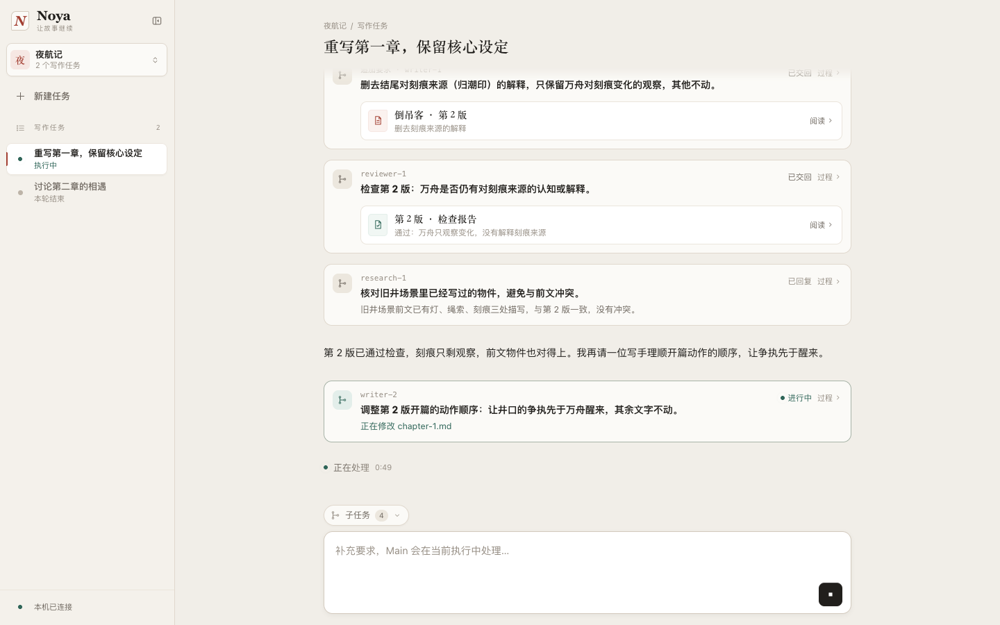
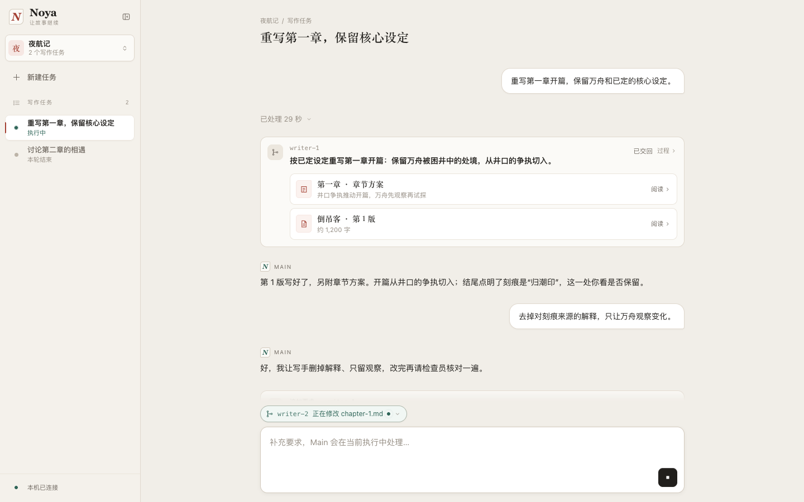
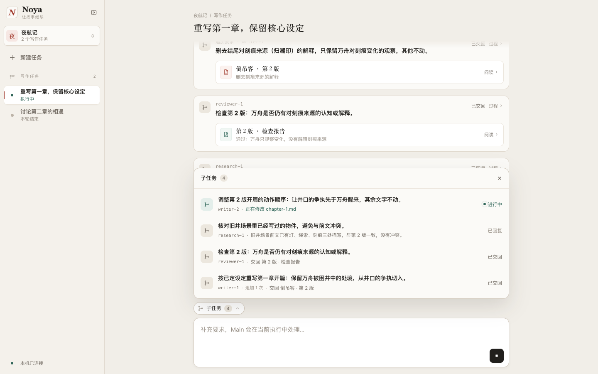
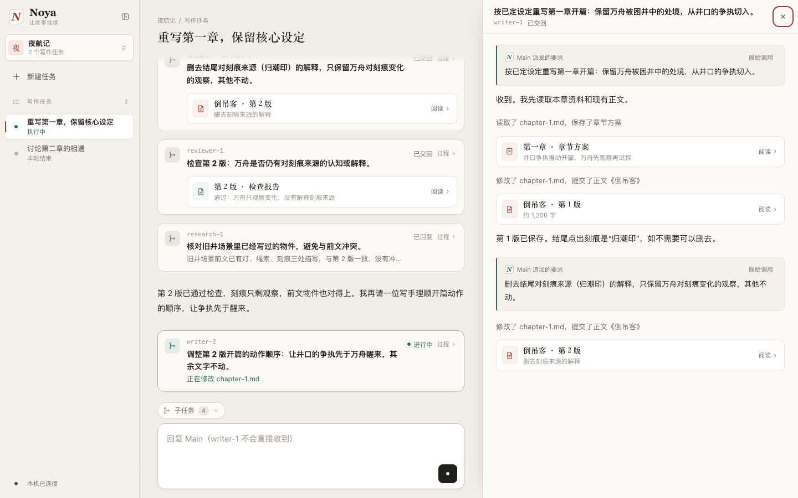

# 查看 Agent 执行过程

## 1. 背景与目标

作者把写作要求交给 Noya 后，Main 会安排写手、检查员等子任务（Sub）去完成。作者最关心三件事：现在在干什么、做出了什么、接下来要自己决定什么。目前任务页主要显示 Main 的文字回复和概括后的动作；Sub 做了什么、交回了什么，作者看不到。

本次把任务页的信息流做成作者与 Agent 协作的主入口：

- 发起要求后，能随时看到进展；
- 子任务交回的稿子和结论直接出现在信息流里；
- 想追究细节时，能读到 Main 和每个 Sub 的完整过程。

## 2. 产品逻辑

信息流按"每次作者发言 → Main 的这一轮处理"组织，采用成果优先的展示方式：

- **进行中的一轮**完整展开：Main 的文字直接可见，思考与工具操作折叠成"读取了 chapter-1.md"这样的动作摘要。底部始终有一行"正在处理"，说明现在的状态。
- **结束的一轮**收成一行"已处理 X 秒"（超过一分钟写作"X 分 Y 秒"），只保留子任务卡片和 Main 的最后一条回复。作者回看时，先看到做出了什么、Main 怎么说，需要时再展开整轮过程。

Main 每派发一个子任务，信息流里出现一张子任务卡片：

- 卡片以 Main 写的一句任务说明为标题，执行中显示当前动作；
- 结束后挂上它交回的成果（可直接阅读）；没有保存成果时，显示 Sub 的最后一句话。

成果是 Sub 交回给 Main 的返回，因此显示在 Main 的卡片上；Sub 的过程记录仍只在它自己的详情里。

点卡片或输入框上方的子任务入口，任务页右侧打开该 Sub 的详情面板，主信息流留在左侧。面板按时间展示 Main 给出的要求、Sub 的执行过程和交回的成果。

Main 和各 Sub 的过程内容使用同一套规则。工具名称、参数、输出和错误保留原文，不按写手、检查员等业务角色改写或筛选。

可离线打开的 [交互原型](prototype.html) 使用固定样例演示交互。

## 3. 功能清单

| 功能 | 作者要回答的问题 | 入口 |
| --- | --- | --- |
| 发起与跟进 | 现在在干什么？要不要补充或停止？ | 主信息流底部的实时状态、输入框 |
| 成果透出 | 做出了什么？哪些需要我决定？ | 主信息流的子任务卡片、Main 的回复 |
| 子任务详情 | 某个 Sub 被要求做什么、怎么做的、交回了什么？ | 子任务卡片、输入框上方的子任务入口、右侧详情面板 |
| 离开与恢复 | 切换或中断后，记录是否完整、归属是否准确？ | 原任务切换、返回与继续入口 |

## 4. 功能描述

### 4.1 发起与跟进

作者在输入框发送要求后，要求以作者消息出现在信息流，Main 开始这一轮处理。

- **实时状态**
  - 进行中的一轮，信息流底部显示"正在处理"和本轮已用时长；停止过程中显示"正在停止"。
  - 断线时改为"连接断开，最新进展尚未确认"，不继续计时，也不推断完成或失败。
  - 任务标题下不再重复显示"执行中"；作品侧栏的任务列表仍显示任务状态。
- **Main 的过程**
  - Main 的文字消息直接显示，流式文字在原消息中更新。
  - 同一次执行中连续的思考与工具操作合成一组，默认收起，只显示一句动作摘要，不显示步数或调用次数。
    - 摘要写"做了什么 + 对象"，例如"查阅了设定：万舟""读取了 chapter-1.md，提交了正文《倒吊客》"。
    - 动作超过 3 项时显示前两项和"等 N 项"；正在执行的动作写在最后，如"正在修改 chapter-1.md"。
    - 没成功的动作不写成"修改了"：报错写"修改 chapter-1.md 失败"，停止或中断写"已停止""未完成"并排在最前；工具返回没有改动时写"未改动 chapter-1.md"。
    - 不认识的工具直接显示原工具名。
  - 展开后按发生顺序逐行列出思考与工具操作，每行可再展开，查看原工具名、完整参数、执行中输出、最终返回和错误。
  - 常规的开始、结束执行不单独显示；停止、作者定稿等事件在原位置保留一行说明。失败和中断由子任务卡片与页面提示说明，不再重复加分隔行。
- **补充与停止**
  - 本任务执行中、输入框为空时，发送按钮变为停止按钮；一旦输入文字，又变回发送按钮，发出的补充要求仍交给 Main 在当前执行中处理。
  - 另一条任务正在执行时，当前任务可以输入但暂不能发送，输入框下方说明是哪条任务在执行。
  - 停止始终指向实际执行的任务（见 4.4）。
- **首次使用**：新任务显示空态，提示"告诉 Main 这一章想怎么写"；还没有子任务时，不显示子任务入口。

### 4.2 成果透出

Main 派发或继续一个子任务时，信息流在对应位置出现子任务卡片。

| 卡片部分 | 内容 |
| --- | --- |
| 标题 | Main 派发时写的一句任务说明，如"按已定设定重写第一章开篇"，最多两行。说明只给作者看，不交给 Sub；Sub 收到的仍是写作材料本身。旧记录没有说明时，标题显示 Sub 身份，并注明"未写任务说明" |
| 次要信息 | Sub 身份（如 writer-1）；Main 给同一个 Sub 追加要求时标为"追加要求 · writer-1" |
| 状态 | 进行中、正在停止、已交回（保存了成果）、已回复（没有保存成果，只给出了答复）、未交回成果（没有成果也没有答复）、失败、已停止、已中断，全页使用同一套说法 |
| 状态下方 | 进行中：当前动作；失败：错误原文第一行；已停止或已中断：说明未收到最终返回；已回复：Sub 的最后一句话 |
| 右上角 | 状态旁常驻"过程 ›"，提示整张卡片可以点开详情 |
| 交回的成果 | 该次执行保存的每份成果单独一行，显示标题和一句说明，点"阅读"打开。检查报告也是成果，说明行写结论，如"通过：万舟只观察变化" |

- **一轮结束后的收起**
  - 每次作者发言后的那一轮结束后，过程收成一行"已处理 X 秒"（超过一分钟写作"X 分 Y 秒"），默认收起。收起时仍显示：子任务卡片、Main 的最后一条回复、非常规事件。
  - 点击这一行展开整轮记录，按发生顺序显示；再点收起。作者的展开选择在刷新后保留。
  - 进行中的一轮不收起。
  - 最后一轮以失败、中断或停止结束时，收起行改为"处理 X 秒后失败／中断／停止"并带相应颜色；收起时不再保留 Main 出事前的最后一条回复，避免读起来像仍在进行。
- **Main 的收尾**：一轮里的子任务都结束、Main 不再等待时，Main 用一条回复说明本轮结果和需要作者决定的事，例如"第 2 版已通过检查……满意就可以定稿"。这一条就是收起后保留的"最后一条回复"。
- **阅读成果并做决定**
  - 从卡片打开的成果在右侧显示，正文不可编辑；关闭后回到信息流原位置。
  - 点"对这版提意见"：回到输入框，输入框上方标明针对哪一份成果（如"倒吊客 · 第 2 版"），可以取消。意见发给 Main，由 Main 安排修改。
  - 点"将这版定稿"：确认后，这份成果在所有位置标为"作者已定稿"，信息流留一行"作者已定稿"，Main 随后安排资料核对。任务执行中不能定稿。
  - 成果保存、检查通过、作者定稿、资料变更应用分别表达，查看不会替作者做决定。
- **同一个 Sub 多次执行**：每次派发或追加要求各有一张卡片，只挂那一次交回的成果；较早的版本仍能从它所在的卡片打开。

### 4.3 子任务详情

作者想了解某个 Sub 时，有两个入口：点信息流里的子任务卡片，或点输入框上方的子任务入口后在列表里选择。两处入口打开同一个详情面板。

- **子任务入口**
  - 位于输入框上方，不随信息流滚动。进行中子任务的卡片就在屏幕上时，入口只显示"子任务"和总数，避免同一状态说两遍；卡片滚出屏幕后，只有一个子任务进行中时，入口直接显示"writer-2 正在修改 chapter-1.md"；多个进行中显示"N 个子任务进行中"；同时有失败的，在后面追加"· N 个失败"；没有进行中但有失败时显示"N 个子任务失败"；都结束后显示"子任务"和总数。
  - 点击后在输入框上方展开列表，再次点击、点关闭、按 Escape 或点击外部都会收起。列表不遮罩页面，输入框和信息流仍可操作。
  - 列表每行显示：首次派发时的任务说明、身份、追加要求次数、当前动作或交回结果，以及状态。进行中的排在前面，其余按最近活动排列，全部列出，超出高度时在列表内滚动。
- **详情面板**
  - 宽屏时在任务页右侧打开，主信息流留在左侧继续可读、可输入；窄屏时全屏打开。面板高度固定，内容独立滚动。
  - 右侧同一时间只显示一项：详情面板开着时，从信息流打开另一个子任务或成果，会替换当前内容。
  - 顶部显示任务说明、身份和状态，右上角关闭。按 Escape 也可关闭，关闭后焦点回到信息流中这个子任务的卡片。
  - 内容按时间展示：Main 派发的要求（全文） → 这次执行的过程与交回的成果 → Main 追加的要求 → 下一次执行……追加的要求出现在它实际发生的位置，不会被提到最前面。
  - 某次执行失败时，这次执行的末尾直接写出"执行失败："和错误原文第一行；停止或中断时写明"未收到最终返回"。完整原文在对应操作里展开。
  - 每段要求右侧有"原始调用"，展开后可看派发调用的原工具名、完整参数和返回。
  - Sub 的过程规则与 Main 相同：消息直接可见，思考与工具成组折叠，成果显示为可阅读的条目。进行中时，底部显示"正在处理"和这次执行的已用时长；断线时与主信息流一样改为"连接断开，最新进展尚未确认"并停止计时。
- **从详情阅读成果**：成果在同一位置打开，底部按钮为"返回子任务"，返回后恢复原来的详情和阅读位置。提意见与定稿同 4.2。
- **输入归属**：打开详情时，输入框提示"回复 Main（writer-1 不会直接收到）"。作者的输入始终发给 Main。

### 4.4 切换、停止与继续

作者可以在任务 A 执行时查看任务 B，或切换到另一部作品。信息流始终属于当前所选任务，页面顶部保留返回实际执行任务和停止它的入口。

- **切换与刷新**
  - A 的晚到消息和输出只更新 A，不会插入 B，也不覆盖 B 的详情面板、阅读位置或输入。
  - 切换任务时关闭详情面板与子任务列表；返回 A 或刷新页面后，恢复已保存的过程、展开状态与阅读位置，不重发上一条要求。
  - 停止始终指向实际执行的任务 A，不随当前查看 B 改变。
- **执行结束与恢复工作**
  - 请求停止后，实时状态、进行中的卡片与输入框提示都改为"正在停止"，确认结束后在信息流里留下"已停止"一行。失败、停止和中断都保留已收到的过程和已交回的成果。
  - 执行已停止或中断、但工具还没收到最终返回时，该调用显示"已停止／已中断，未收到最终返回"，保留参数与已有输出，不再显示进行中，也不补造返回。对应的子任务卡片同样如此说明。
  - 子任务正常结束但没有保存成果时，卡片显示"已回复"和 Sub 的最后一句话，没有任何答复时显示"未交回成果"；工具调用成功不等于工作目标完成。
  - 失败、停止或中断后，输入区出现"继续任务"。同一 Sub 再次执行时出现新的卡片；新安排的 Sub 使用独立身份，旧记录仍可读。
  - 长时间没有新内容时，实时状态继续计时，不因静默推断完成、失败或自动重试。

### 4.5 状态无法确认或记录不完整

| 情况 | 页面表现与恢复路径 |
| --- | --- |
| 页面断线 | 顶部提示断线，可重试连接；已加载内容照常可读。进行中的状态标为"最后已知"，实时状态改为"连接断开，最新进展尚未确认"；不把断线写成执行失败 |
| 重连成功 | 补齐遗漏内容，合并同一消息与调用，保留打开的详情、展开状态与阅读位置，不重复启动工作 |
| 程序退出后重启 | 原先未结束的执行显示中断；已结束的历史结论、输出和成果保留，作者明确继续后才重新安排 |
| 旧任务未保存完整过程 | 展示已有的消息、状态与成果，并指出缺失范围；不补造工具调用或思考 |
| 单份成果无法读取 | 原位置保留标题，并标明"暂时无法读取"；打开后可重试，其他记录仍可读 |
| 思考内容未提供或不可读 | 只显示"思考 · 内容不可读"，不补写 |
| 不认识的内容类型 | 保留它的存在与归属，能读取的原内容可展开，不因类型陌生整条丢弃 |

## 5. 验收标准

| 场景 | 预期 |
| --- | --- |
| 发送要求后 Main 尚未派发 Sub | Main 的消息直接可见，过程组折叠为动作摘要；底部显示"正在处理"和用时；不显示子任务入口 |
| 过程组摘要 | 写"动作 + 对象"，不显示步数或调用次数；不认识的工具显示原名；展开后逐行可读，原工具名与完整参数、输出、错误可达 |
| 派发子任务后执行中 | 出现子任务卡片，以 Main 写的任务说明为标题，显示当前动作；输入框上方入口显示同一 Sub 的当前动作 |
| 子任务交回成果 | 卡片状态变为"已交回"，每份成果单独一行，可直接阅读；检查类成果附一句结论 |
| 子任务结束但没有保存成果 | 有最后答复时显示"已回复"并附这句话；没有答复时显示"未交回成果"；都不伪装成交付 |
| 成果页提意见或定稿 | 提意见：输入框标明针对哪份成果的哪一版，发给 Main；定稿：确认后所有位置标为"作者已定稿"，信息流留一行记录 |
| 一轮结束 | 过程收为"已处理 X 秒"或"X 分 Y 秒"，子任务卡片与 Main 最后一条回复仍可见；展开后按发生顺序显示完整记录 |
| 执行中输入补充要求 | 输入后停止按钮变为发送；补充要求发给 Main，不打断当前执行 |
| 打开子任务列表 | 列表在输入框上方展开，不遮罩页面；行内容与卡片状态一致；关闭、Escape、点外部均可收起 |
| 从卡片或列表打开详情 | 右侧面板显示同一个 Sub；要求、过程、成果按时间排列，追加的要求位于实际发生位置；主信息流位置不变 |
| 详情内查看原始调用 | 展开派发调用的原工具名、完整参数与返回，再次点击收起 |
| 详情中打开成果再返回 | 成果只读，"返回子任务"后回到原详情和阅读位置；从信息流打开成果会替换右侧详情 |
| 打开详情时输入 | 输入框提示接收方为 Main，发送内容进入 Main 的信息流 |
| Main 与多个 Sub 并行 | 主信息流只有 Main 的记录和子任务卡片，Sub 的过程不混入；各卡片状态独立更新 |
| 流式文字、工具中间输出到最终返回 | 更新对应消息或调用，内容不重复、不遗漏，不提前标为完成 |
| 失败、停止、中断 | 卡片、过程摘要与详情末尾如实说明，摘要不写成"修改了"；收起行标明失败、中断或停止；已交回的成果仍可阅读 |
| 阅读旧内容时有新回复，随后自己滚到底 | "查看最新"提示在到达底部后自动消失 |
| 切换任务或作品，原任务晚到内容 | 只更新原任务；返回与停止目标准确，各任务的输入保持 |
| 刷新、断线重连或程序重启 | 不重发要求；过程合并无重复，展开状态与阅读位置保留，中断与旧结论准确 |
| 旧记录缺失或单份成果损坏 | 明示缺失范围，可重试该项，其他内容仍可读 |
| 窄屏 | 子任务详情与成果全屏打开，可关闭返回；卡片、列表与输入区无横向溢出 |

## 6. 附件

[可离线打开的交互原型](prototype.html)（本地预览地址 http://127.0.0.1:53979/p/01-tasks 需先启动画布服务）。固定样例用于评审信息流与子任务详情的交互，不作为真实 Agent 执行、记录保存或产品开发完成的证据。原型地址后加 `?scenario=failed`、`no-result`、`interrupted`、`offline`、`empty` 可分别查看失败、未交回成果、中断、断线和新任务状态。使用统计本轮暂不做。
