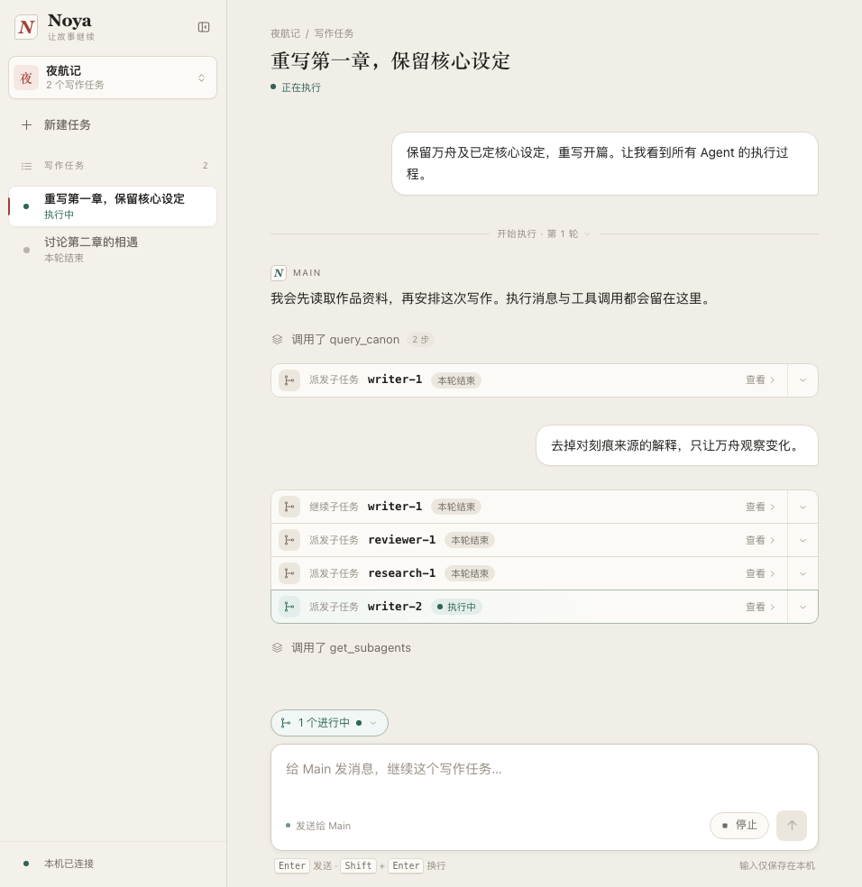
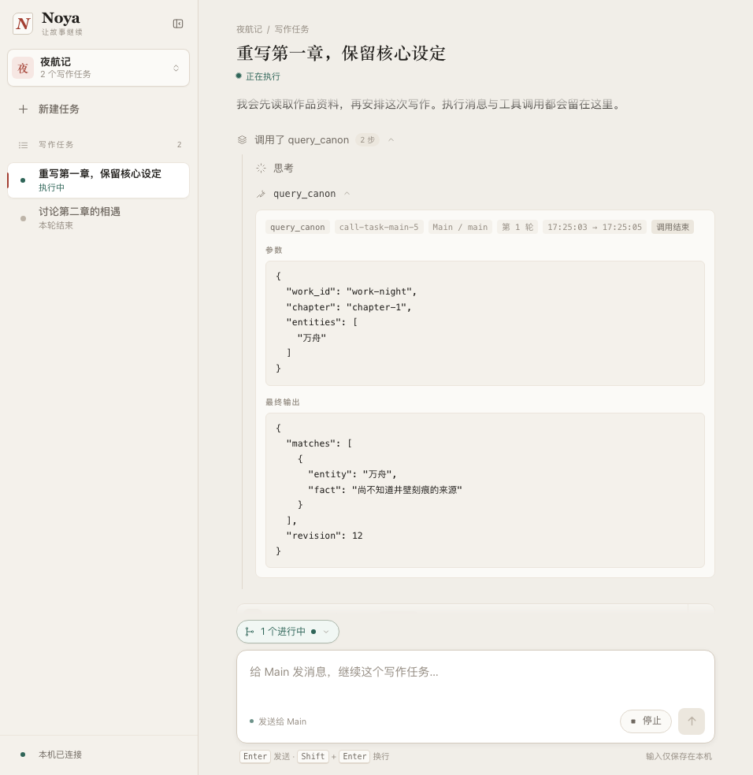
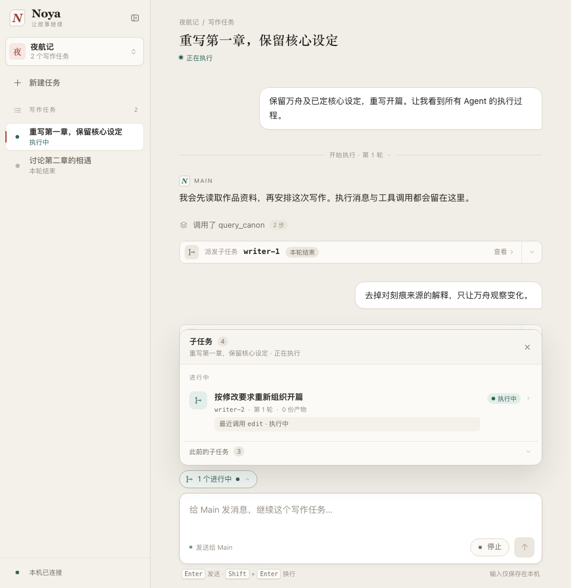
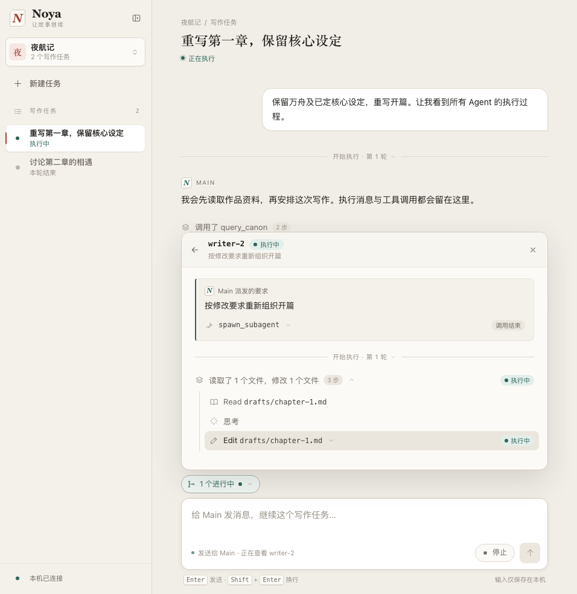

# 查看 Agent 执行过程

## 1. 背景与目标

作者把要求交给 Noya 后，需要知道 Agent 正在做什么、调用了什么工具、返回了什么，以及失败发生在哪里。目前任务页主要显示 Main 的文本回复和概括后的动作，Sub 的具体过程不可见。

本次在原任务页查看 Main 和各个 Sub 的完整可见过程。主信息流显示 Main，每个 Sub 在自己的详情中展示消息、工具调用、输出和状态；各处使用相同的内容规则。

## 2. 产品逻辑

作者在原任务里提出要求，主信息流随 Main 执行持续更新。普通消息与保存结果直接可见，思考与工具过程默认收起，相邻记录合并为过程组。折叠时用“读取 1 个文件”等简短动作概括，展开后按顺序平铺活动记录；运行与异常仍可辨认，原工具名和完整内容可继续展开查看。

Main 派发子任务后，信息流保留紧凑单行的子任务入口；输入框上方的子任务入口可以展开浮层，作者随时查看正在执行或已结束的 Sub。选中子任务后，先查看独立的派发要求上下文，再阅读该 Sub 自己的过程和保存结果；主信息流保持原位置。各处的运行记录分别呈现，内部遵循相同规则。

过程内容保留实际收到的名称与原文。文字、可显示的思考说明、工具参数、调用期间输出、最终返回和错误采用通用展示，不按写手、检查员等业务角色改写或筛选。执行记录里的已保存结果仍可只读打开，关闭后返回原位置。

[体验可点击原型](http://127.0.0.1:55249/p/01-tasks)。原型使用固定样例演示交互；另附自包含的 [交互原型](prototype.html)。

## 3. 功能清单

| 功能 | 作者要回答的问题 | 入口 |
| --- | --- | --- |
| 看完整过程 | Main 或某个 Sub 做了什么，工具返回了什么？ | Main 主信息流与各 Sub 详情 |
| 定位与阅读 | 这是谁的记录，如何读全内容、打开保存结果？ | 输入框上方的子任务浮层与派发入口 |
| 离开与恢复 | 切换或中断后，记录是否仍然完整、归属是否准确？ | 原任务切换、返回与继续入口 |

## 4. 功能描述

### 4.1 在任务页阅读完整过程

作者发送要求后，在主信息流阅读 Main 的执行。Main 实际派发子任务后出现对应入口，作者从派发入口或输入框上方打开 Sub 的独立过程详情。

- **统一呈现内容**
  - Main 和 Sub 内部使用同一套内容类型与展开方式，名称、参数、输出和错误保留原文，不依业务角色挑选内容。
  - 思考、工具明细和技术事件的原内容默认收起，正在执行的工具也不自动展开；消息、保存结果与子任务派发入口保持可见。
  - 长内容可以折叠，但始终能展开读全；历史较多时可以继续读取更早记录，不以摘要代替原内容。
  - 暂不认识的工具名称或 Agent 身份仍正常显示；暂不能直接呈现的内容保留类型与可读取的原内容入口，明确指出不可用部分。
- **合并相邻过程**
  - 同一 Agent、同次执行中连续的思考与普通工具记录合并为一个过程组，默认收起；用简短动作摘要表达已记录的活动。
  - 读取文件、搜索或运行命令等数量依据可确认的记录；不能确认动作时保留原工具名。仅有思考时显示思考，时长只在有实际依据时显示。
  - 展开后按发生顺序平铺工具和思考活动，每行可继续读取原工具名、完整参数、输出或思考内容；运行、报错、停止、中断及状态未知仍可辨认。
  - 在每个 Agent 自己的记录中，消息、执行分界、保存结果或子任务派发开始新的组；其他 Agent 的活动不打断本 Agent 的连续记录。
  - 新内容接到原组，调用更新留在原位置；用户已展开或收起的状态保持，组内失败会在折叠摘要中明确提示。
- **识别归属与顺序**
  - 主信息流属于 Main，作者消息通过自身消息样式区分；Sub 详情的身份由浮层标题提供，连续内容沿用所在视图的上下文。
  - 记录保留所属执行与时间，可通过悬停记录或展开技术明细查看；派发记录关联发起者与子任务。
  - 各 Agent 的消息、调用与结果按自身发生顺序显示。并行执行时分别更新各自的记录，迟到完成仍留在原调用位置。
  - 同一 Agent 后续继续工作保留新的执行分界；替换产生的新 Agent 使用独立身份，历史内容保持原归属。
- **跟随持续执行**
  - 文字和调用期间的输出持续更新。工具开始、输出更新与结束属于同一次调用，展开后能读到完整参数及全部已收到的输出。
  - 并行调用分别更新；工具返回、Agent 本次执行结束和整项写作任务结束各自表达，不能互相代替。
  - 作者阅读旧内容时保留位置，Main 的新记录提示只对应 Main；查看 Sub 时更新该 Sub 的记录并保留位置。点击查看最新才跳转，更新不收起已展开内容，也不覆盖未发送输入。

| 实际收到的内容 | 作者看到什么 |
| --- | --- |
| 作者消息、Agent 文字消息 | 消息原文与发送者；流式文字在原消息中更新 |
| 可显示的思考说明 | 默认在折叠过程组内；活动行显示思考及可确认的时长，展开可读原内容，不可读只说明事实 |
| 普通工具调用 | 默认在折叠过程组内；简短动作摘要与平铺活动行，原工具名、状态、完整参数、输出与错误可读 |
| 调用期间输出 | 本次调用已经收到的原始输出，后续内容接续保留 |
| 工具返回或报错 | 返回内容或错误原文；保留已收到的中间输出，失败不抹掉参数与输出 |
| 子任务派发或继续记录 | 紧凑单行使用父子节点分支图标、轻量青绿标识，显示子任务名称与真实状态，点击进入 Sub；目标与结果在详情中查看，原调用参数与返回仍可展开 |
| 开始、停止、结束等技术事件 | 显示可确认的事件状态，原内容默认收起，可展开阅读 |
| 已保存结果 | 原保存记录与结果入口；可以只读打开，仍能查看对应调用的完整输出 |

### 4.2 随时找到 Sub，读全内容与结果

作者想跟进某个 Sub 时，可以从信息流的子任务入口直接打开详情，也可以点击输入框上方的子任务入口，向上展开列表浮层。该入口属于当前所选任务，不随信息流滚走。点击任务行后，同一浮层显示该 Sub 的过程，顶部保留任务名称、返回列表与关闭入口。

- **找到子任务**
  - 输入框上方用紧凑入口显示当前子任务状态与进行中数量；默认过程流直接显示内容。
  - 展开浮层显示可区分身份、真实派发的任务、当前状态、最近已记录动作与已保存结果。进行中的子任务优先，历史仍可找到。
  - 派发入口在实际派发位置出现，直接关联对应 Sub；同一 Sub 的继续记录保留新执行归属，新 Sub 不合并旧身份。
  - 两个入口显示相同的真实状态并打开同一详情。尚未派发时说明没有子任务；缺失任务描述时明确未保存，不从别的任务补齐。
- **展开与收起浮层**
  - 再次点击入口、点击关闭、按 Escape 或点击浮层外部均可收起；收起只改变查看状态。点击输入框后仍能直接输入，消息与页面其他控件保持可操作。
  - 窄屏浮层限制高度并可独立滚动，保持在可见范围内。切换任务时收起浮层，保留该任务的输入、过程展开与阅读位置。

- **在浮层阅读过程**
  - 详情将派发与补充要求作为独立上下文，随后只展示所选 Sub 的完整可见过程和结果；内部思考与工具仍默认折叠，原文可展开。
  - 浮层独立滚动，持续更新保持当前阅读位置；返回列表或关闭不切换主信息流，不抢走其位置。
  - 作者输入始终发给 Main，查看 Sub 时明确提示接收方。查看、展开和读取结果只改变阅读方式，停止与继续沿用原任务入口。

- **展开与返回**
  - 文字、工具参数、输出和错误使用通用展开方式。空返回明确显示为空；部分输出后失败同时保留已有内容与错误。
  - 从浮层打开结果时，结果只读并显示可确认的名称、版本与归属；返回恢复原 Sub 详情、展开项和阅读位置，窄屏行为相同。
  - 保存初稿、检查通过、作者定稿、资料变更应用仍分别表达，过程查看不会替作者作出决定。

### 4.3 切换、停止与继续

作者可以在任务 A 执行时查看任务 B，或切换到另一部作品。过程流始终属于当前所选任务，实际执行任务保留明确的返回入口。

- **切换与刷新**
  - A 的晚到消息和输出只更新 A，不插入 B，不覆盖 B 的子任务详情、阅读位置或输入。
  - 返回 A 或刷新页面后，恢复已保存过程、过程组展开状态、子任务查看范围与阅读位置，不重发上一条要求；继续执行产生的新内容接续显示。
  - 停止入口始终明确指向实际执行的任务 A，不随当前查看 B 改变目标。
- **执行结束与恢复工作**
  - 请求停止后先显示正在停止，确认结束才显示已停止。失败、停止和中断保留已收到过程与已保存结果。
  - 执行已确认停止或中断、工具仍未收到最终返回时，该调用显示“已停止／已中断，未收到最终返回”，保留参数与已有输出，不继续显示运行中，也不补造返回。
  - 正常结束但未保存结果时如实显示本次执行结束、没有保存结果；工具调用成功不等于工作目标完成。
  - 作者通过原任务的继续入口或对话继续。同一 Agent 的新执行与旧记录分开；重新安排的新 Agent 保持独立身份，旧过程仍可读。
  - 长时间没有新内容时保留最近记录与时间，不因静默推断完成、失败或自动重试。

### 4.4 状态无法确认或记录不完整

| 情况 | 页面表现与恢复路径 |
| --- | --- |
| 页面断线 | 保留已加载过程与结果，说明最新状态尚未确认；自动重连，不把断线写成执行失败 |
| 重连成功 | 补齐遗漏内容，合并同一消息与调用，保留当前 Sub、展开与阅读位置，不重复启动工作 |
| 程序退出后重启 | 原未结束执行显示中断；已结束的历史结论、输出和保存结果保留，作者明确继续后才重新安排 |
| 旧任务未保存完整过程 | 展示已存在的消息、状态与结果，并指出缺失范围；不补造工具调用或思考说明 |
| 单项内容无法读取 | 原位置保留身份、类型及已知内容，显示不可用并可重试；其他记录仍可读 |
| 某类内容不可读或无法直接呈现 | 说明该部分不可读，保留其存在与归属；能够读取的原内容仍可展开，不因类型陌生整条丢弃 |

## 5. 验收标准

| 场景 | 预期 |
| --- | --- |
| Main 尚未派发 Sub | Main 的消息、思考说明、工具参数与输出已经可查看，无虚构 Sub |
| Main 与 Sub 调用同类工具 | 过程与工具明细默认折叠，使用相同规则，原名称、完整参数、输出与错误仍可读 |
| 相邻思考和普通工具 | 在各 Agent 自己的流中按同次执行连续合组；消息、执行分界、产物或派发断开，其他 Agent 活动不打断 |
| 阅读折叠摘要与活动列表 | 简短动作摘要可展开为按顺序排列的活动行，原名与全文可达；数量、时长有实际依据，运行与异常可见，两处规则相同 |
| Main 与多个 Sub 并行 | 主流仅 Main，各 Sub 详情仅所选 Agent；派发要求是独立上下文，各自结果可读，Sub 更新不触发 Main 新记录提示 |
| 连续内容或查看单个 Sub | 沿用所在视图的身份；轮次与时间按需查看，原记录保留 |
| 折叠组内调用持续更新或失败 | 不自动展开、不重建顺序，用户展开状态保留；失败在组摘要可见 |
| 滚动到历史时需要跟进 Sub | 输入框上方的子任务入口仍可找到，身份、任务、状态与信息流派发入口一致 |
| 展开或收起子任务浮层 | 浮层锚定输入区，无页面遮罩；关闭、Escape、点外部可收起，输入与其他页面操作正常 |
| 无 Sub、多个同类 Sub 或新旧 Sub | 空态准确，身份可区分，旧记录保留，不串到其他任务 |
| 新工具或新 Agent 身份 | 通用呈现可读内容，能定位归属，类型陌生不造成记录消失 |
| 多 Agent 或多工具并行 | 各 Agent 内部按发生顺序呈现，每次调用可区分；迟到完成不重排已有记录 |
| 流式文字、工具中间输出到最终返回 | 更新对应消息或调用，读全已收到内容，不重复、不遗漏、不提前标完成 |
| 可读、未提供和不可读的思考说明 | 展示实际可读内容；缺失或不可读明确说明，不补写 |
| 读取长内容或更早历史 | 全文和旧过程可达，折叠不删除内容，更新不抢阅读位置 |
| 从派发入口或浮层列表打开 Sub 详情，再返回或关闭 | 定位同一个 Sub，主信息流位置不变，输入始终明确发给 Main |
| 浮层打开保存结果再返回 | 结果只读，版本归属准确，恢复原 Sub 详情、展开与阅读位置，工具完整返回仍可看 |
| 已有输出或结果后失败、停止 | 原内容与错误、停止事实同时保留，不误报整项工作完成 |
| 停止或程序退出时调用尚未返回 | 显示调用已停止或中断、未收到最终返回，已有参数与输出仍可读 |
| 同一 Agent 继续或被新 Agent 替换 | 保留执行分界与独立身份，历史不改写，结果不串归属 |
| 切换任务或作品，原任务晚到内容 | 只更新原任务；返回与停止目标准确，所看任务输入保持 |
| 刷新、断线重连或程序重启 | 不重发指令；过程合并无重复，中断与旧执行结论准确 |
| 旧记录缺失或单项损坏 | 明示缺失范围，可重试该项，其他内容与已有结果仍可读 |
| 窄屏读工具、结果并返回 | 内容可读、控件可达，阅读器焦点与返回位置正确 |

## 6. 附件

[可离线打开的交互原型](prototype.html)。固定样例用于评审各 Agent 独立记录的查看交互，不作为真实 Agent 执行、记录保存或产品开发完成的证据。使用统计本轮暂不做。
