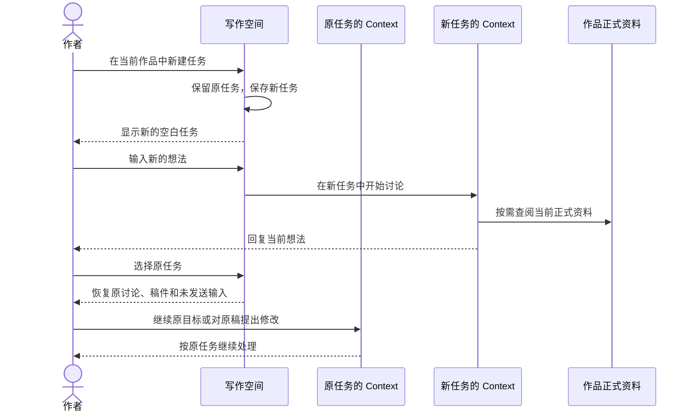

# 写作任务新建与切换

## 1. 背景与目标

作者已经可以在本机页面讨论、写稿、修改和定稿，但进入一部作品后，只能继续它最近的任务。想换一个写作目标时，旧讨论仍留在眼前，也没有入口另开任务后再回来。

这次让一部作品拥有多个独立写作任务：作者可以开始新的讨论，也能找回旧任务继续。作品的正式资料共享，每个任务的讨论、初稿和待决定问题分别保留。

## 2. 产品逻辑

作者在当前作品中打开任务入口，选择“新建任务”，进入独立的空白起点。新任务不会自动继承旧讨论；需要继续旧稿时，作者切回对应任务。新建和切换都不打断正在执行的任务，页面始终说明实际执行在哪里。

图中的发送发生在没有其他任务执行时。只创建或查看任务，不启动任何 Agent。

## 3. 功能清单

| 功能 | 说明 |
| --- | --- |
| 新建任务 | 在当前作品中建立独立的讨论与写作起点 |
| 切换和继续任务 | 找到已有任务，阅读原稿并继续原来的工作 |
| 查看其他任务的执行 | 保留正在执行的任务，明确返回或停止后再开始别的任务 |
| 恢复上次工作 | 重开后恢复具体任务，并找到尚需处理的资料同步 |

## 4. 功能描述

### 4.1 从当前作品开始新任务

当前任务标题旁提供任务入口，作者可以查看本作品已有任务，也可以新建。

- **创建**
  - 点击“新建任务”后，保存成功才进入空白任务，不要求先填写名称或章节。
  - 旧任务的记录与未发送输入保留。新任务不自动发消息、写稿或定稿。
  - 新任务可以讨论想法、查资料或提出写作要求；一次任务不强制对应一章。
- **识别任务**
  - 尚未发言的任务显示“新任务”、创建时间和可区分的短标识。
  - 发出首条消息后，以该消息开头帮助识别任务；创建时间仍可见。
  - 交稿或定稿不会自动新建任务，作者决定何时换一个工作目标。
- **创建未完成**
  - 创建期间避免重复点击；同一次创建重试只得到一个任务。
  - 明确失败时留在原任务并保留输入。结果暂时未知时先确认是否已创建，再决定重试。

### 4.2 新任务保留什么

新任务继续使用同一部作品，但拥有独立的讨论和稿件。

| 内容 | 新任务中的处理 | 如何继续旧内容 |
| --- | --- | --- |
| 正式设定、已经定稿的正文 | 可以查阅当前内容 | 所有任务使用同一部作品当前的正式资料 |
| 旧任务的讨论、废案和未定稿正文 | 不自动带入，不作为当前任务的默认材料 | 切回原任务阅读或修改 |
| 尚未回答的问题或确认 | 留在提出问题的任务 | 切回原任务回答 |
| 未发送输入、所引用稿件及阅读位置 | 分别保存，新任务从空白开始 | 切回原任务恢复 |

新任务不会把作者在旧任务中没有接受的建议变成正式设定，也不会因为新建而清空旧任务。

### 4.3 找回旧任务并继续

任务入口只列当前作品的任务，显示名称、创建时间和状态；按创建时间从新到旧排列。查看某个任务不会改变列表顺序。

- **打开与继续**
  - 选择旧任务后，恢复它的讨论、稿件、输入和待决定问题。
  - 作者可在原任务里继续讨论、提出修改或对明确版本定稿。
  - 原写手已经结束时，Context 根据保存材料重新安排并说明情况；历史记录不代表原写手仍在运行。
- **共享资料已变化**
  - 返回旧任务不会把作品还原到过去。后续写作和资料写入使用当前正式依据。
  - 旧确认涉及的内容已变化时，说明它已过期，重新呈现具体内容供作者决定。
  - 重新定稿会替换已有正式正文时，仍需明确告知；其他任务中的旧稿和讨论保留。
- **记录不可用**
  - 某条任务记录损坏时，在选择入口说明该任务不可用，其他正常任务仍可进入。
  - 不把一次面向旧任务的操作悄悄改成对最新任务执行。

### 4.4 任务还在执行时

作者可以在等待任务 A 的时候新建或查看任务 B。页面同时显示当前查看的任务和实际执行的任务。

| A 的情况 | 在 B 中可以做什么 | 怎样继续执行 |
| --- | --- | --- |
| 正在讨论、写稿、检查或同步 | 查看记录、读稿、保留未发送输入 | 等 A 结束，或明确停止 A |
| 正在停止 | 继续查看与输入 | 等实际停止完成，不能提前开始 B |
| 等待作者决定且没有后台执行 | 在 B 发送要求 | A 的问题保留，稍后回 A 回答 |
| 已结束本轮、失败、停止或中断 | 查看结果并选择下一件事 | 在选定任务明确发送或继续 |

“返回执行任务”直接回到 A，哪怕 A 与 B 属于同一作品。停止也明确针对 A，已保存内容保留。A 的晚到回复和稿件只进入 A，不覆盖正在查看的 B。

这一规则同样适用于不同作品，以及同时打开的多个页面。其他页面创建任务，不会强制切换当前页面。

### 4.5 作品资料尚未同步时

新建任务不能绕过作品的待同步章节。作者仍可查看、讨论和查询；需要安排写手生成或重写正文时，先处理资料同步。

- **找到原同步任务**
  - 显示待处理章节，提供回到对应任务的入口。
  - 原任务有冲突待决定或被作者停止时，在原任务中处理后再继续。
  - 完成后作者回到此前任务，明确继续原写作要求；不会自动启动另一任务。
- **旧记录没有对应任务**
  - 说明只找到了待同步章节，允许作者明确选择在当前任务继续同步。
  - 此后同步归当前任务负责，切换或重启仍返回这里；不能在其他任务重复承接。
  - Context 根据当前定稿正文和正式资料重新整理，不借用其他任务未完成的确认。
- **正文再次定稿**
  - 替换正式正文后，原同步清单和针对旧正文的决定不再有效。
  - 新的定稿由此次定稿的任务负责同步；原任务保留历史记录并说明正文已被替换。

纯措辞修正沿用现有能力，保存后仍是未定稿版本。资料记录损坏时先说明错误，不把损坏解释为“没有同步任务”。

### 4.6 离开后再回来

打开作品时优先恢复上次查看的具体任务；没有有效选择记录时进入最新创建的正常任务。作品从未有任务时，保留直接进入首个空白任务的体验。

- **页面刷新或重新打开**
  - 恢复所选任务、它的输入与阅读内容，重新显示实际执行状态。
  - 仅查看不会重发上一条要求，也不会让旧任务重新开始。
- **程序退出后启动**
  - 已保存记录和正文仍在，原执行显示中断；作者继续时重新安排工作。
  - 中断的资料同步回到真正负责它的任务，不被后来创建的空白任务覆盖。
  - 作者明确停止或尚待决定的任务不自动恢复。
- **已有数据升级**
  - 已有任务直接出现在入口中，无需作者搬动或重新创建。
  - 原来按作品保存的输入和阅读内容，首次升级只归回它原先对应的最近任务，不复制给每个新任务。

## 5. 验收标准

| 场景 | 预期 |
| --- | --- |
| 当前作品已有讨论，点击新建 | 得到独立空白任务，旧讨论与输入保留 |
| 创建成功但响应丢失后重试 | 找回同一个任务，不产生重复空白任务 |
| 新任务查询已有材料 | 可用正式资料，不混入旧讨论和旧初稿 |
| 两个任务都有“第一版”稿件 | 读取、修改和定稿始终作用于选中的任务及版本 |
| 新建后切回旧任务继续修改 | 使用原任务要求和稿件，修改结果保存在原任务 |
| 同作品 A 执行时查看 B | A 继续，B 不并行执行，返回和停止准确指向 A |
| A 待决定，在 B 更新正式资料后回 A | 已过期确认不能直接写入，需重新说明和确认 |
| 资料待同步时，在旧任务要求内容重写 | 先定位并处理同步，再由作者明确继续重写 |
| 旧数据在 B 承接同步后停止，再进入 C | C 引导回 B，保留 B 的停止与决定状态 |
| 另一任务重新定稿同一章 | 新定稿任务负责同步，旧清单与决定不能写入 |
| 选中非最新任务后刷新或重启 | 恢复选中任务，执行与中断状态真实 |
| 旧任务同步中断后已有新空白任务 | 恢复仍指向旧同步任务 |
| 升级后进入已有作品 | 任务、对话、稿件和原输入保留，不重复复制 |
| 某条任务损坏 | 指明问题，其他正常任务仍可查看 |

